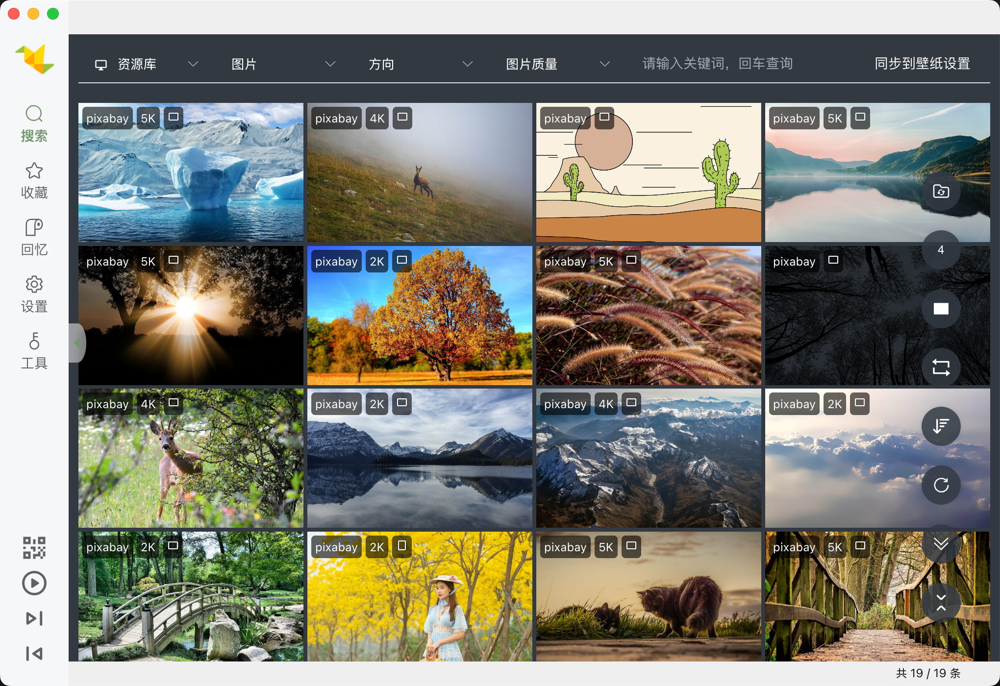
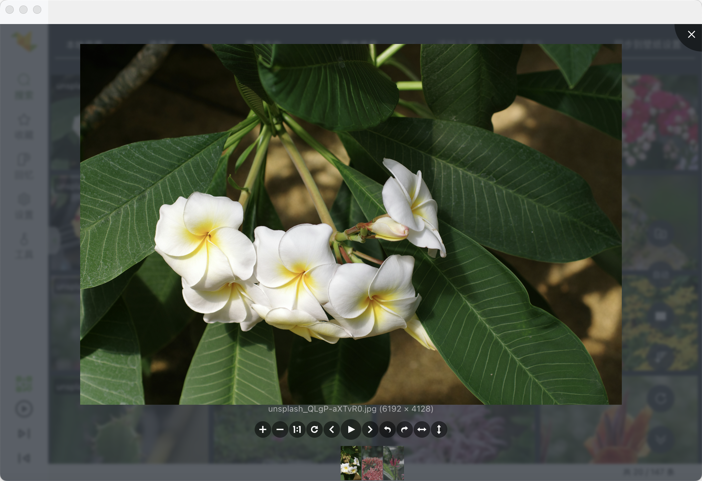
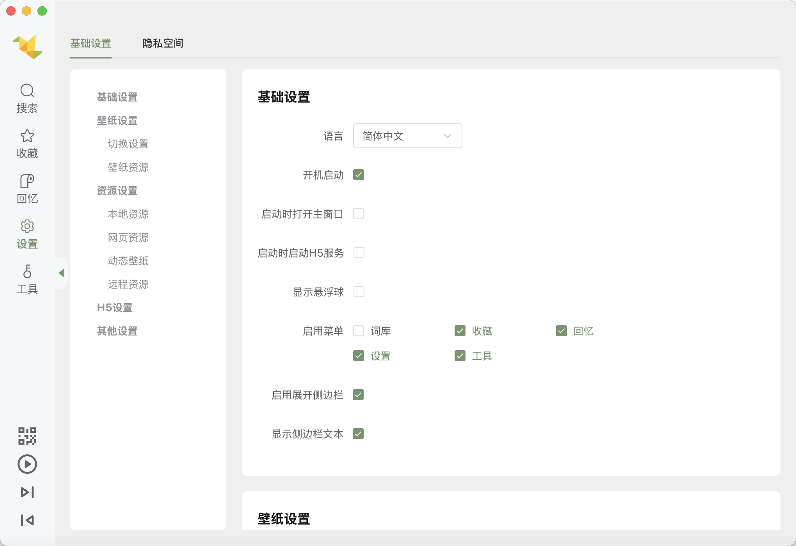
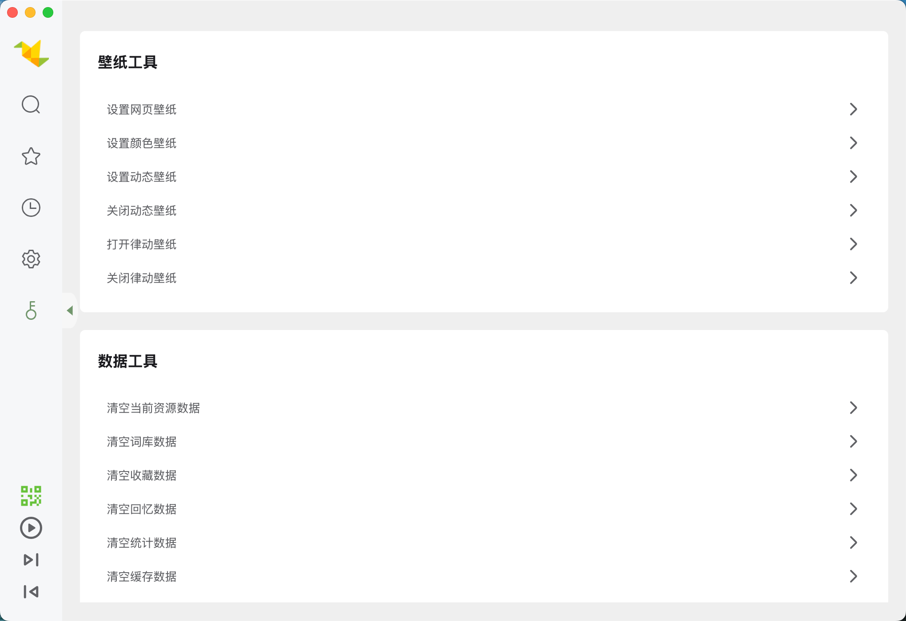
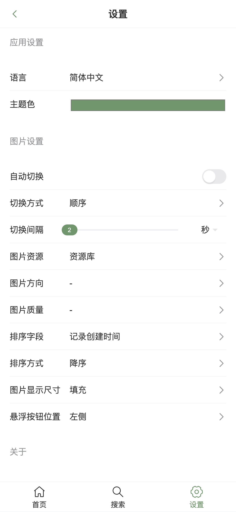

# 飞鸟壁纸

飞鸟壁纸是一款精美图片浏览器，让你轻松浏览、收藏心动美图，并一键设置壁纸，打造独一无二的桌面风格。













## Project Setup

### Install

```bash
$ npm install
```

### Development

```bash
$ npm run dev
```

### Build

```bash
# For windows
$ npm run build:win

# For macOS
$ npm run build:mac

# For Linux
$ npm run build:linux
```
