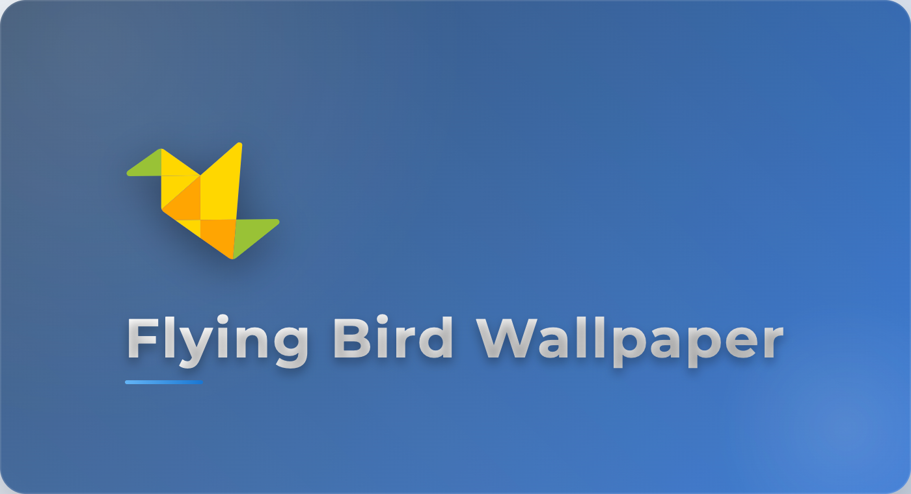

  

# Flying Bird Wallpaper

  <!-- License -->
  
  <!-- Downloads total -->
  
  <!-- Release -->
  
  <!-- Workflow status -->
  
  <!-- DeepWiki -->
  

  <h3>English | <a href="README-zh.md">简体中文</a></h3>
  

## Project Introduction

Flying Bird Wallpaper is a cross-platform desktop wallpaper application that allows you to easily browse, favorite, and set beautiful images as your desktop wallpaper with one click.

## [Preview](./docs/preview.md)

## Core Features

1. **Multiple Wallpaper Sources** - Integrates high-quality wallpaper sources such as NASA, Unsplash, Pixabay, supports custom wallpaper source plugins, and local directory images.
2. **Smart Search** - Supports keyword search and intelligent classification for quick access to your favorite wallpapers.
3. **One-Click Management** - Set wallpaper, favorite images, and save locally with one click for efficient operation.
4. **Desktop Floating Ball** - Quickly switch wallpapers without opening the main interface.
5. **H5 Version** - Supports mobile access, browse wallpapers anytime, anywhere.
6. **Multi-language Support** - Built-in multilingual interface to meet international needs.
7. **Auto Update** - Automatically checks for updates to keep the application up to date.
8. **Cross-Platform Compatibility** - Perfectly supports Windows and macOS systems.
9. **Scheduled Tasks** - Set scheduled wallpaper changes, directory refresh, resource downloads, and automatic desktop background switching.
10. **Word Bank Function** - Automatically generates a word bank through word segmentation for quick keyword search.
11. **History** - Records used wallpapers for easy review and reuse.
12. **Favorites** - Collect your favorite wallpapers and build a personal wallpaper library.
13. **Private Space** - Provides a privacy-protected wallpaper storage space to ensure personal privacy.
14. **Image Preview** - Supports wallpaper preview to view details and effects.

## Experimental Features

1. **Dynamic Wallpaper** - Supports dynamic wallpapers to add vivid effects to your desktop.
2. **Webpage Wallpaper** - Supports setting web pages as wallpapers for unlimited creativity.

## Tech Stack

- **Electron Framework** - Ensures cross-platform compatibility
- **Vue 3 Frontend** - Builds a modern user interface
- **Modular Design** - Improves application stability
- **Plugin System** - Supports extending new wallpaper sources
- **SQLite Database** - Local storage for user data
- **WebSocket Communication** - Enables real-time interaction between frontend and backend

## System Requirements

- Windows 10 or above
- macOS 10.13 or above

## LICENSE

MIT License

Copyright (c) 2025-present OXOYO

<!-- GitAds-Verify: 2DQDBEC5WHGXH8Q8198DF9OQ85LSRDJ4 -->

## GitAds Sponsored

## Contact

    
    
Add me to the group, remark [Project Name]

---

Flying Bird Wallpaper, make your desktop brand new!
