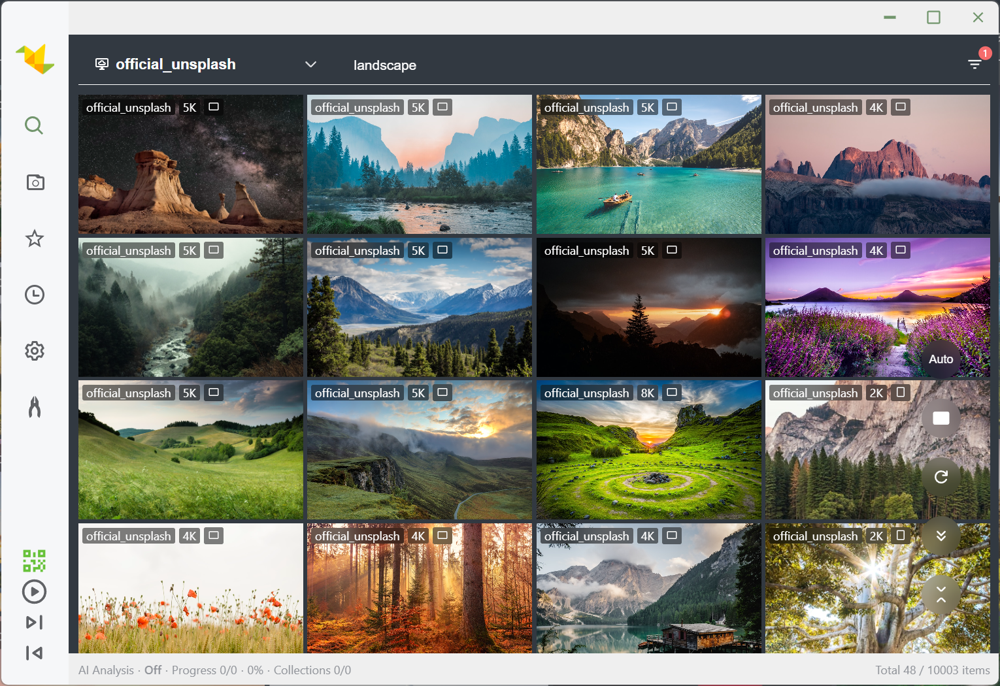
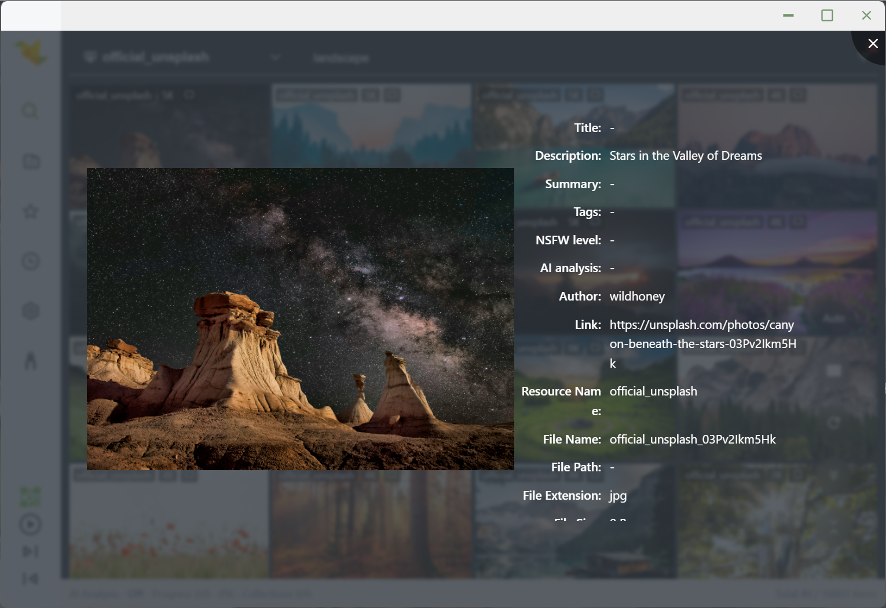
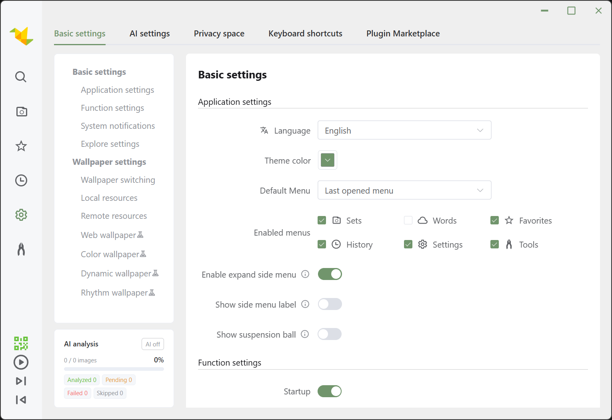
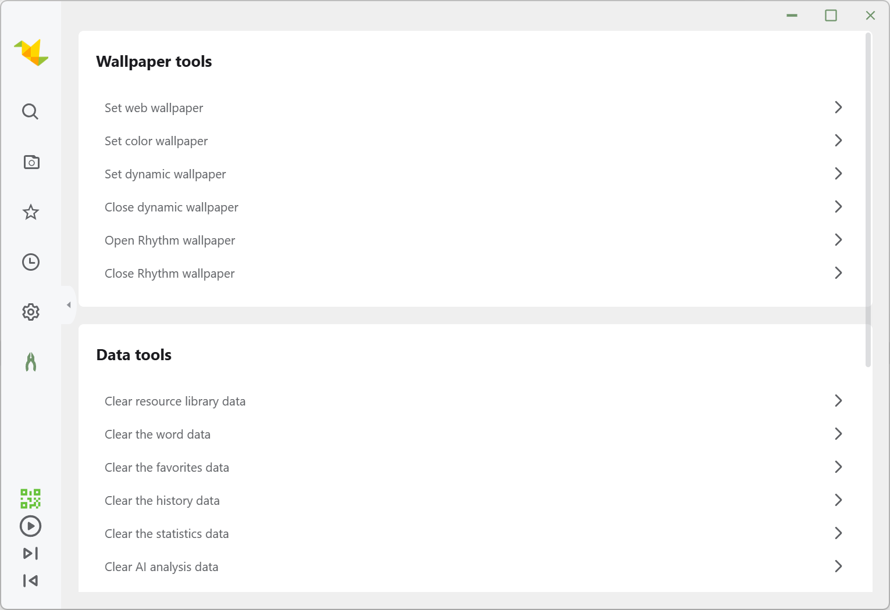
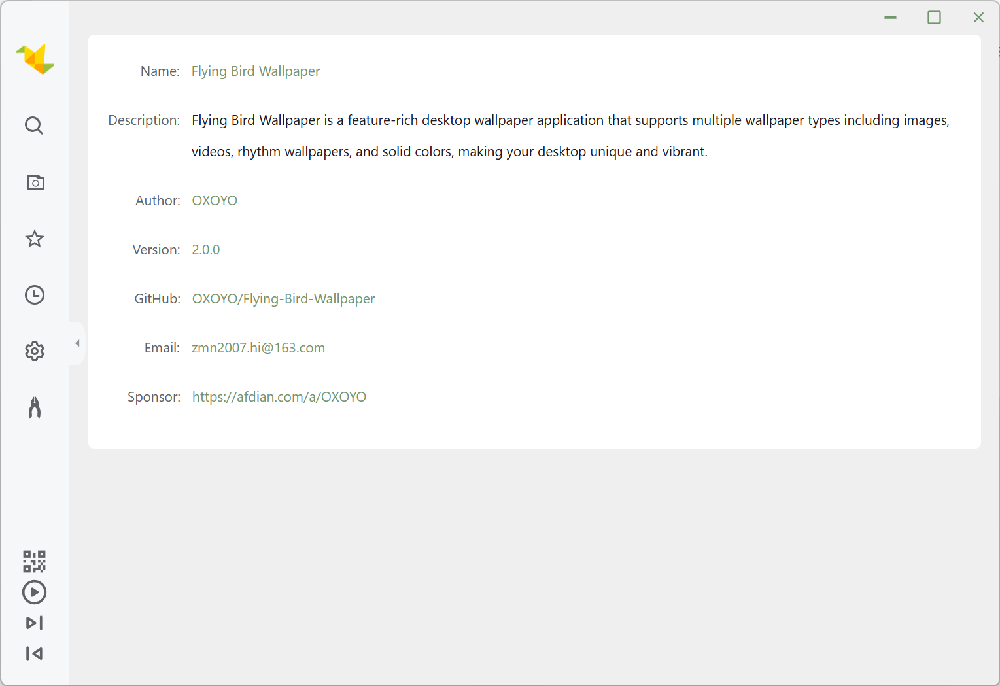
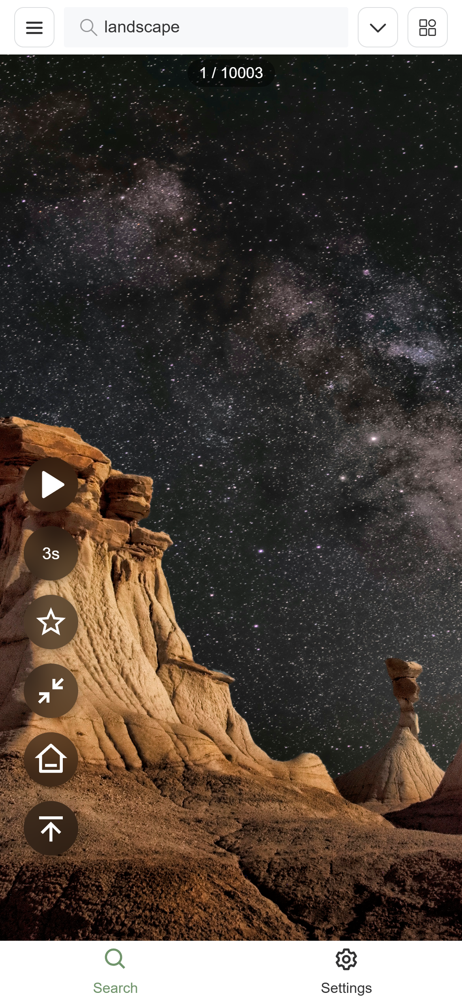
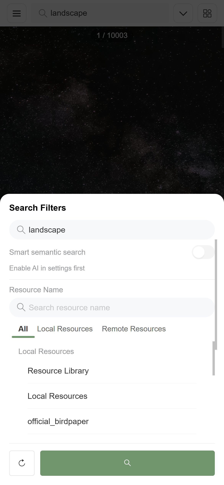
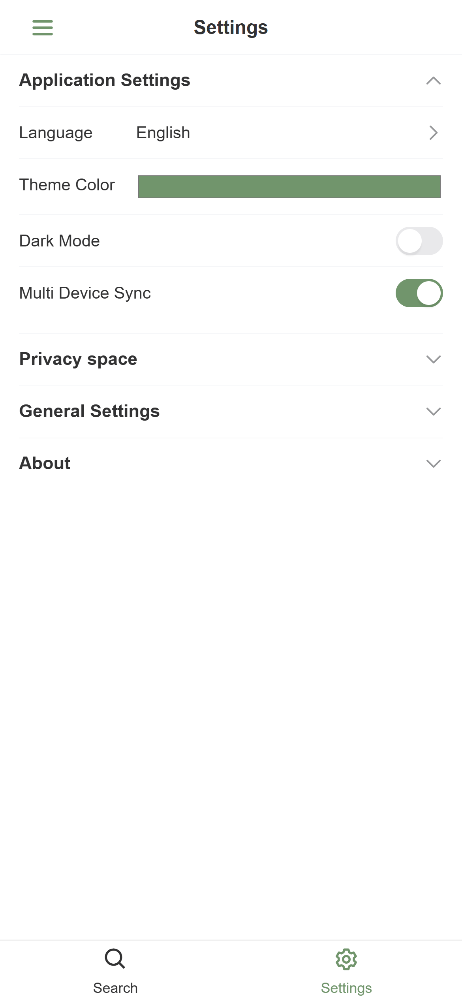

## Preview

### Desktop

#### Rhythm Wallpaper Effects

**Concert Bars (ThreeStageBars, default)**

**Neon Wall Matrix (ThreeStageWall)**

**Floor Pillar Grid (ThreeStageGrid)**

**Textured Sphere (ThreeStageTexturedSphere)**

**Room Mesh Terrain (ThreeStageRoomMeshGrid)**

### H5 Mobile

