## 预览效果

### 桌面端

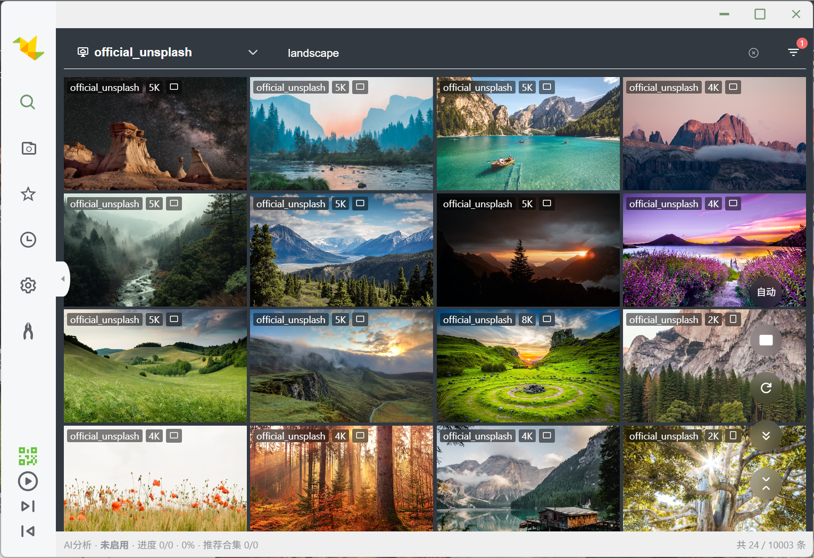

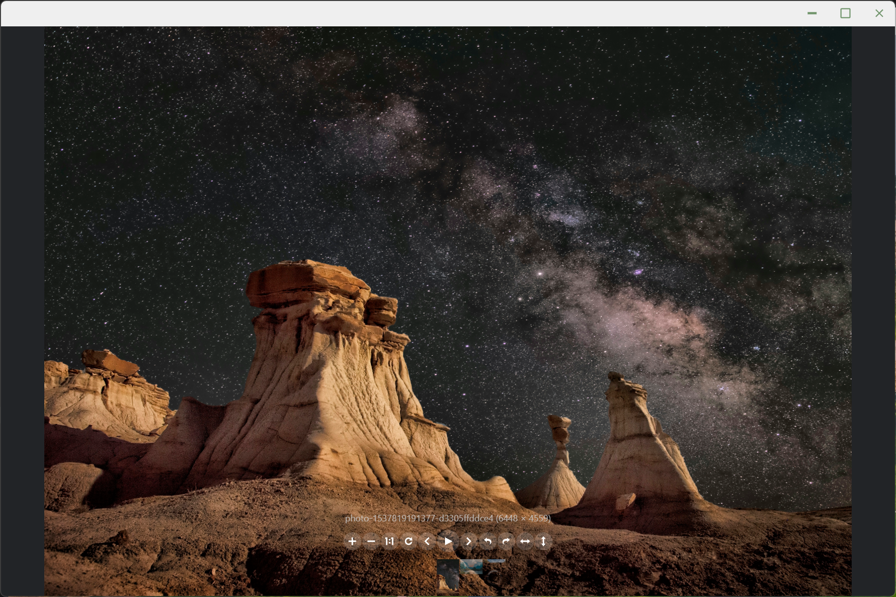

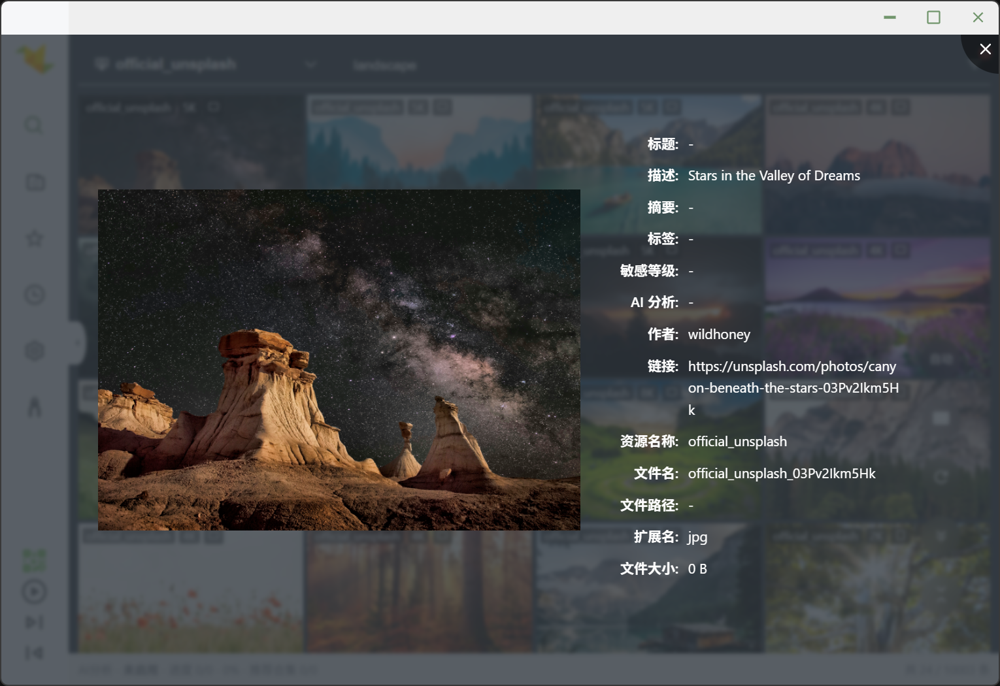

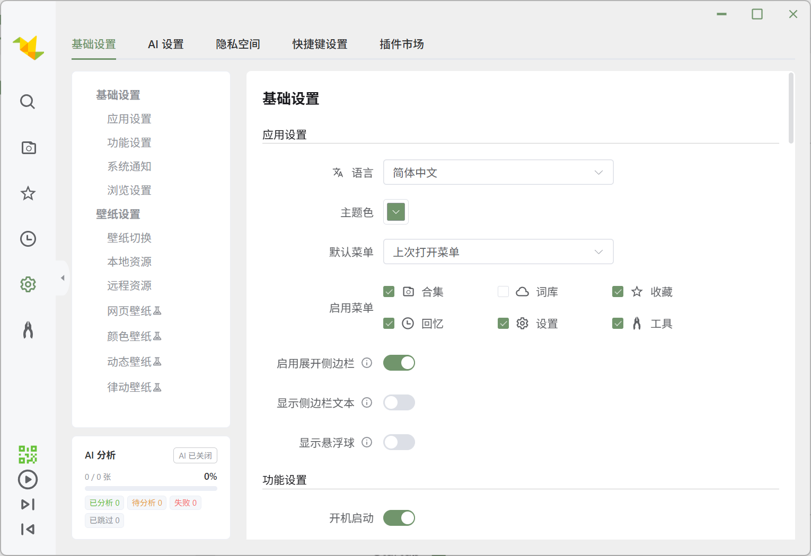

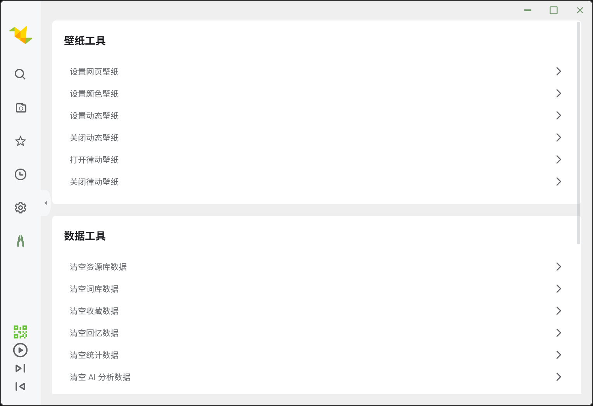

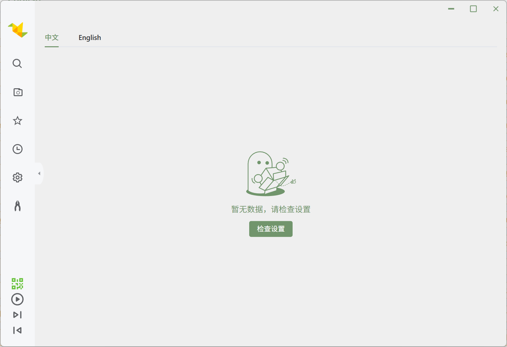

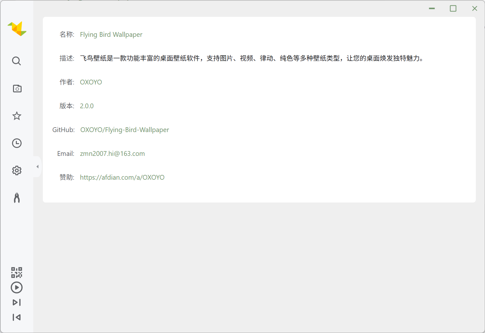

#### 律动壁纸效果

**演唱会柱（ThreeStageBars，默认）**

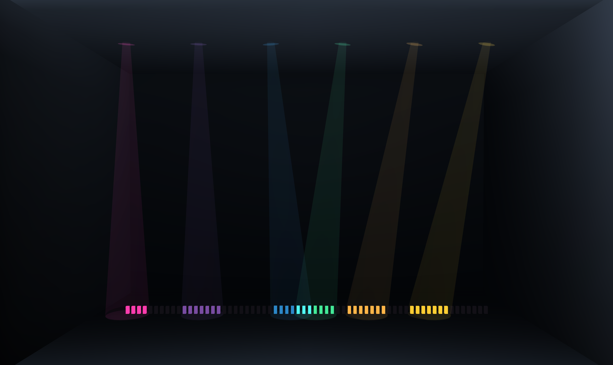

**霓虹墙矩阵（ThreeStageWall）**

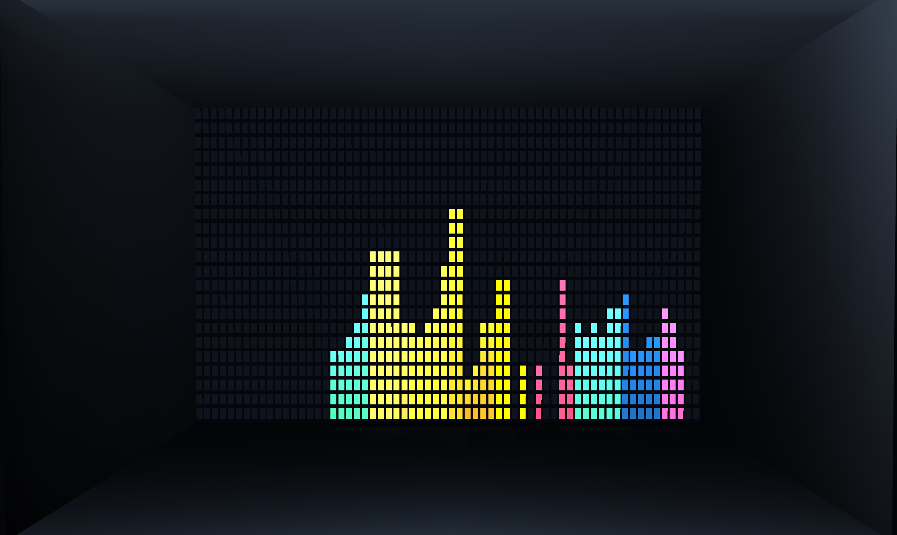

**地柱网格（ThreeStageGrid）**

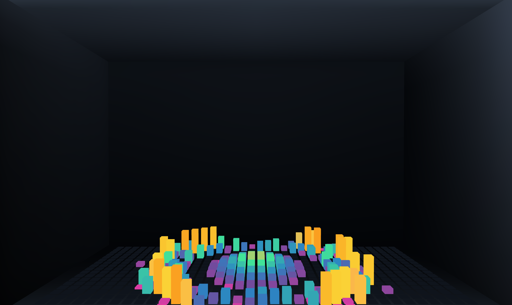

**纹理球体（ThreeStageTexturedSphere）**

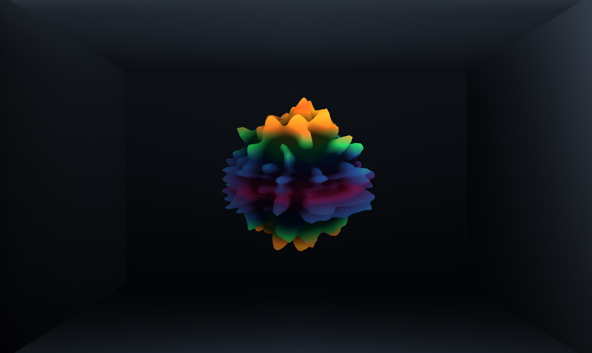

**房间网格地形（ThreeStageRoomMeshGrid）**

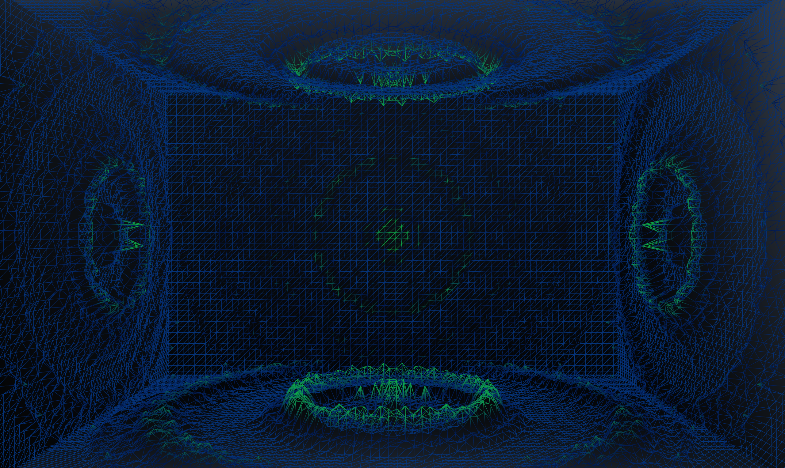

### H5 移动端

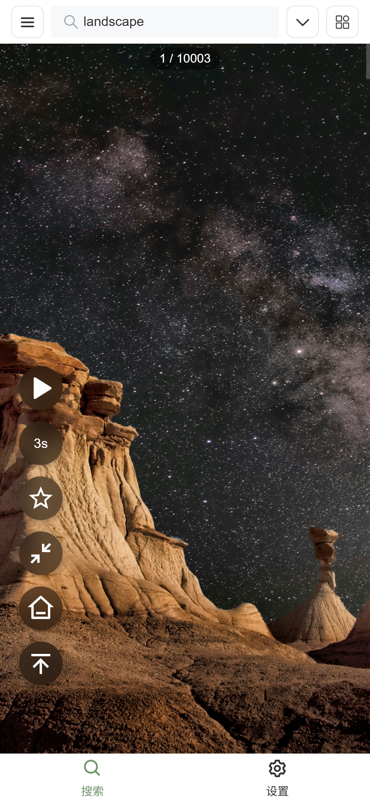
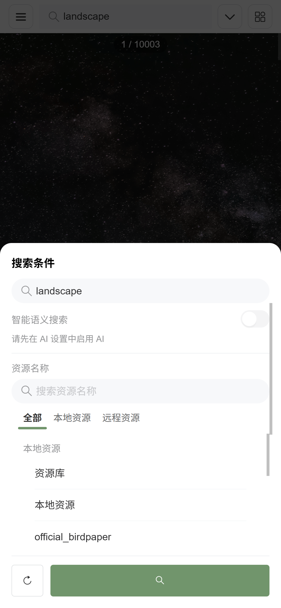
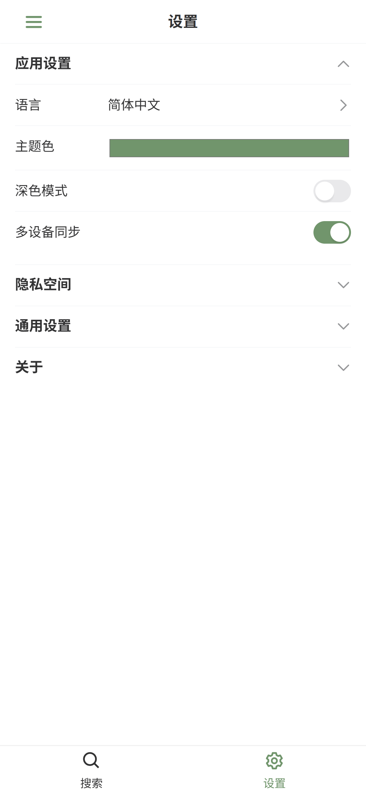
