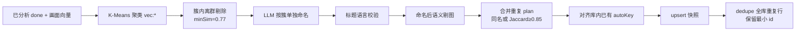
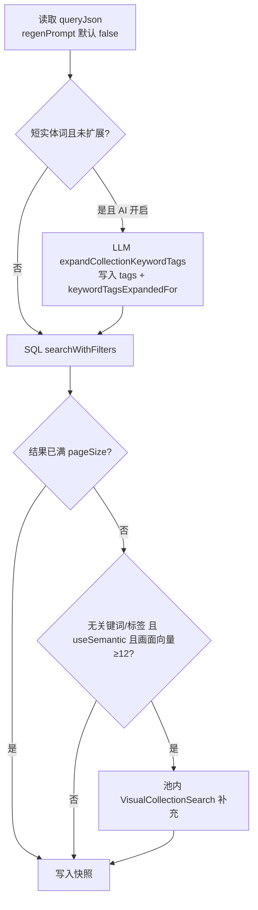

# 智能合集：策展规则与合集页体验（2.0.0+ 增量）

> 文档版本：**v1.8**  
> 整理日期：**2026-06-05**  
> 状态：**已实现**（含 **猜你喜欢** 桌面 + H5）  
> 关联：[ai-dev-plan.md](./ai-dev-plan.md) · [resource-lifecycle-and-cleanup.md](./resource-lifecycle-and-cleanup.md) · [ai-visual-embedding-and-similar.md](./ai-visual-embedding-and-similar.md) · [README.md](./README.md)

---

## 1. 概述

本增量在 Sprint 3 基础上完善：

1. **系统自动策展**：入选壁纸改为 **最低评分门槛**（不再用固定 40 条上限）；合集数量上限可在 AI 设置配置；**分析队列稳定并完成至少一轮自动整理后暂停定时/防抖**（手动整理不受限）。  
2. **合集页**：壁纸列表 **分页加载**；缩略图与搜索页一致（`w=1080`）；卡片 **主色占位** 与探索页一致。  
3. **猜你喜欢**：Picker 独立 Tab + 虚拟项，**不入库**；与「AI 推荐」系统合集分区命名分离。  
4. **AI 设置**：`scoreMinFilter`、`autoCollectionsMaxCount` 置于「AI 自动整理合集」开关下方；后台 `analysisMaxRetries` 默认 1（**无 UI**，见 [ai-analysis-ux-and-performance.md](./ai-analysis-ux-and-performance.md)）。

---

## 2. 系统自动策展规则

### 2.1 流水线（v1.6：按簇命名 + 剔图 + 同名/高重叠合并）



实现：`CollectionCurator.mjs`、`VectorCluster.mjs`、`collectionConstants.mjs`、`AiPrompts.mjs`、`AiResponseParser.mjs`。

**v1.5 相对 v1.4 的变化：**

| 项 | v1.4 | v1.5 |
|----|------|------|
| 候选来源 | 标签 `tag:*` + 画面 `vec:*` → LLM **合并** | **仅**画面 K-Means `vec:*` |
| 命名 Prompt | `buildCollectionMergePrompt`（已删） | `buildCollectionNamingPrompt`（每簇独立，禁止跨簇合并） |
| 解析 | `normalizeCollectionMergePlan`（已删） | `normalizeCollectionNamingPlan` |
| 标题语言 | 无强制 | 须与 **UI locale** 一致（script 检测） |
| 成员过滤 | 簇级余弦阈值 | 命名后再按 **标题 n-gram** 剔图 |
| 规则降级 | 硬编码「氛围 N」等 | `resolveAtmosphereFallbackName`（同语言 aiTitle → tags） |
| 入库 prompt | 硬编码中文 | `buildAutoCollectionStoragePrompt` + i18n `pages.Collections.auto.storagePrompt` |

遗留：`tag:*` / `merged:*` 旧系统合集在手动整理时会被 `removeLegacyTagAutoCollections` 清理。

**版本摘要：**

| 版本 | 要点 |
|------|------|
| v1.5 | 仅画面 K-Means；按簇 LLM 命名；UI locale 对齐；语义剔图 |
| **v1.6** | 同名 / 成员 Jaccard≥0.85 合并；progressive 不再累积重复系统合集 |

### 2.2 合集数量

| 项 | 说明 |
|----|------|
| 公式 | `target = clamp(3, round(√已分析数 × 1.2), cap)` |
| 起步 | 至少 **8** 张 `aiAnalysisStatus=done` 才开始生成 |
| 下限 | 至少 **3** 个系统合集（库够大时） |
| 上限 `cap` | **`ai.autoCollectionsMaxCount`**（默认 **20**，可调 **3～50**） |

读取：`resolveAutoCollectionCountMax(ai)`、`computeAutoCollectionCount(analyzed, ai)`。

### 2.3 入选壁纸（按评分，无条数硬顶）

| 项 | 说明 |
|----|------|
| 门槛 | **`ai.scoreMinFilter`**（0～100，默认 **70**）；搜索与系统合集 **始终** 按最低分过滤 |
| 作用范围 | 标签 SQL、向量簇成员过滤、写入快照前排序 |
| 已移除 | `AUTO_COLLECTION_ITEM_LIMIT`（原每合集最多 40 张）；「不限制」按钮（空值迁移为 70） |

同一标签/氛围下，**所有满足分数门槛** 的已分析图均可进入快照（可能很多张，靠合集页分页浏览）。

### 2.4 其他阈值（代码常量）

| 常量 | 值 | 含义 |
|------|-----|------|
| `AUTO_COLLECTION_MIN_TAG_RESOURCES` | 3 | （遗留）单标签候选门槛；v1.5 主路径不再建 `tag:*` |
| `AUTO_COLLECTION_MIN_ITEMS` | 3 | 合并/剔图后合集至少 3 张 |
| `AUTO_COLLECTION_MIN_EMBEDDINGS` | 8 | 画面向量聚类至少 8 条（`fbw_resource_image_vec_blob`，按 active visual model） |
| `AUTO_COLLECTION_CLUSTER_MIN_SIMILARITY` | **0.77** | 簇成员与质心最低余弦（剔离群图） |
| `AUTO_COLLECTION_MEMBER_TITLE_MIN_OVERLAP` | **0.35** | 命名后单图与标题 n-gram 重叠下限（语义剔图） |
| `AUTO_COLLECTION_PLAN_MERGE_MIN_JACCARD` | **0.85** | 同名或成员 Jaccard / 较小集包含比例 ≥ 此值则合并 |
| `AUTO_COLLECTION_INCREMENTAL_MIN_SIMILARITY` | 0.7 | 稳定后增量入集与质心相似度 |

### 2.4.1 标题语言与降级（v1.5）

| 函数 | 说明 |
|------|------|
| `titleMatchesAppLocale(text, locale)` | 粗粒度 script 检测（zh / en / ja / ko / ru / ar 等） |
| `normalizeAutoCollectionTitleForLocale` | 规范化 + 语言校验；不符则回退 |
| `resolveAtmosphereFallbackName(hints, locale)` | 优先同语言 `titleSamples`（aiTitle），其次同语言 tags |
| `validateCollectionTitleAgainstHints` | LLM 标题与簇内语料 n-gram 一致性 |
| `resourceMatchesCollectionTitle` | 命名后剔图：单图 tags/aiTitle 与合集标题重叠 |

**语言三链：**

1. **UI locale** → `buildCollectionNamingPrompt` 的 `{uiLocale}`、降级/校验  
2. **资源 aiTitle/tags** → 分析时写入，**不**随切换 locale 改变  
3. **展示** → 系统合集 `name` 须与当前 UI 语言一致；切换语言后需重新整理才刷新标题

Prompt 约束见各语言包 `ai.prompts.collectionNaming` 第 7 条：`name` 须与 `{uiLocale}` 一致。

### 2.4.2 同名 / 高重叠合并（v1.6）

**背景：** 剔图后不同 `vec:*` 可能同名、成员完全相同（如两个「草原风景」）；progressive 只 upsert 不删旧 `autoKey`，会叠加重复行。

**合并条件（满足任一）：**

1. `normalizeCollectionPlanName(name)` 完全相同  
2. 成员 **Jaccard ≥ 0.85**  
3. 较小成员集 **≥85%** 被较大集包含（成员完全一致会命中）

**三层时机（manual / progressive / finalize 均执行 dedupe；manual/finalize 另保留 `removeStaleAutoCollections`）：**

| 步骤 | 函数 | 行为 |
|------|------|------|
| 1 剔图后 | `mergeDuplicatePlans` → `mergeCollectionPlans` | 本轮 plans 间合并；保留**先出现**的 `autoKey` |
| 2 upsert 前 | `reconcilePlansWithExistingAutoCollections` | 与库内系统合集比对；复用已有 `autoKey` upsert；标记多余 key 待删 |
| 3 upsert 后 | `removeAutoCollectionsByAutoKeys` + `dedupeExistingAutoCollections` | 删标记 key；全库扫描重复项，**保留 id 最小** 的一条 |

**与 manual 全量替换的关系：**

| 模式 | 合并 dedupe | 未入选清理 |
|------|-------------|------------|
| **progressive** | ✅ | 仅 `pruneInvalidAutoCollections`（&lt;3 张） |
| **manual / finalize** | ✅ | `removeStaleAutoCollections`（autoKey 不在本轮 plans） |

日志示例：`合并重复 plan：2 → 1`、`plan「草原风景」vec:4 合并至已有 id=817 (vec:4)`、`合并重复系统合集：移除 id=818…，保留 id=817`。

### 2.5 触发与刷新

#### 自动整理（系统策展 `CollectionCurator`）

| 触发 | 说明 |
|------|------|
| 分析完成（单张） | ~90s 防抖 → `runCollectionCurator`（**未锁存**时） |
| 文本向量化完成 | ~60s 防抖（`EmbeddingManager.onEmbeddingDone`） |
| **画面向量补算完成** | ~60s 防抖（`onVisualEmbeddingDone`） |
| 定时 | 约每 **30min**（**未锁存**时；启动后 ~5min 首次） |
| 设置变更 | `autoCollectionsMaxCount` / `scoreMinFilter` / 自动整理开关 → 清锁存 + ~15s 后整理 |
| 手动 | 合集页「立即整理」；IPC `main:collections:curate` — **始终可用，不受锁存限制** |

#### 分析完成后暂停自动整理（v1.1+）

**问题背景：** 数据不变时若每 30min 仍调 LLM 命名/整理，合集名称/成员可能漂移（模型非确定性 + 剔图阈值变化）。

**策略（`collectionCurateGate.mjs` + `store/index.mjs`）：**

| 项 | 说明 |
|----|------|
| 队列稳定 | `pending=0` 且 `failed=0` 且 `running=false`（`skipped` 不计入未完成） |
| 保证至少一轮 | 首次稳定后通过防抖或启动 ~60s 补跑 **至少一次** 自动整理 |
| 锁存 | 该轮完成后写入 `ai.autoCurateSettled=true`、`ai.autoCurateSettledAnalyzed=已分析数`；停 30min 定时与防抖 |
| 恢复自动 | 又出现 pending/failed；或 `done` 数超过锁存值；或改了评分/上限/自动整理开关 |
| 手动 | **不**写入锁存、**不**因手动整理改变暂停状态 |

`curatorStats` 返回 `autoCurateSettled`、`autoCurateSettledAnalyzed`；**`embeddings` 为画面向量条数**（非文本表），供排查。

#### 用户合集刷新（与系统策展分开）

系统合集 `refreshMode = on_analysis`（**不参与** 15min 的 `collectionsRefresh` 定时）；用户合集支持 `manual` / `1h` / `6h` / `12h` / `24h`。

### 2.6 系统合集 `queryJson`（增量字段）

```json
{
  "autoKey": "vec:0",
  "mergeIds": ["vec:0"],
  "tags": ["夜景", "城市"],
  "semanticQuery": "赛博雨夜都市",
  "useSemantic": true,
  "scoreMin": 70,
  "sortField": "score",
  "sortType": -1
}
```

（无 `limitCount`；条数由评分门槛 + 快照全量决定。v1.5 新写入以 `vec:{n}` 为主；旧 `tag:*` / `merged:*` 逐步清理。）

---

## 3. AI 设置（合集相关）

路径：`src/renderer/.../Setting/components/AiSetting.vue` → **功能选项**。

| 控件 | 字段 | 说明 |
|------|------|------|
| 开关 | `autoCollectionsEnabled` | 系统自动整理合集 |
| 子项 · 数字 | `scoreMinFilter` | 最低评分过滤（默认 **70**，0～100）；同时影响 **搜索** 与系统合集 |
| 子项 · 数字 | `autoCollectionsMaxCount` | 仅当自动整理开启时显示；3～50，默认 20 |

后台分析相关 **`analysisMaxRetries`**（默认 **1**，1～20，设置页不展示）见 [ai-analysis-ux-and-performance.md](./ai-analysis-ux-and-performance.md) §4。合集生成 **不** 使用 `hideUnsafe`；敏感图展示见 [privacy-and-sensitive-content.md](./privacy-and-sensitive-content.md)。

子项在开关下方缩进展示（`ai-curate-sub-options`）。

---

## 3.5 猜你喜欢（For You）

与 **系统推荐合集**（`source=auto`，Picker 分区「AI 推荐」）区分命名与数据路径，避免用户混淆。

| 维度 | 猜你喜欢 | 系统合集 `source=auto` |
|------|----------|-------------------------|
| 存储 | Picker **虚拟项** `FOR_YOU_VIRTUAL_ID = __for_you__`，**不写** `fbw_collections` | 数据库行 + `fbw_collection_items` 快照 |
| Picker | Tab「猜你喜欢」；「全部」Tab 置顶虚拟项 | Tab「AI 推荐」列出 `source=auto` |
| 数据 API | `main:recommend` / H5 `GET /api/recommend` | `collectionsGet` |
| 分页响应 | `{ list, total, startPage, pageSize, prefTags, degraded }` | `{ items, total, ... }` |
| 默认进入 | **无用户/系统合集可选时**默认猜你喜欢；有合集时仍默认第一个合集 | 用户手动选择 |
| 浏览模式 | `recommend` / `collection` / `similar` **三态互斥** | `collection` |
| 找相似 scope | `{ type: 'search', resourceType: 'localResource', resourceName: 'resources' }` | `{ type: 'collection', collectionId }` |
| 操作 | 刷新推荐、`recommendAddAllToFavorites`（最多 500） | 刷新/generate、`collectionsAddAllToFavorites` |
| 降级 | 无偏好 tag 时 `degraded=true`，按 AI 分 + 设壁纸数排序 | — |

**推荐逻辑（`RecommendManager`）：** 最近设壁纸/收藏资源的 tags 加权；对齐 `ai.scoreMinFilter`；tag 零命中则 fallback 全库高分排序。

**代码锚点：**

| 模块 | 路径 |
|------|------|
| Picker 过滤/分组 | `src/common/collectionPickerFilter.mjs` |
| 桌面合集页 | `src/renderer/.../pages/Collections.vue` |
| 悬浮按钮 | `src/renderer/composables/useCollectionFloatingButtons.mjs` |
| H5 合集页 | `src/h5/pages/collections/index.vue` |
| H5 浏览 | `useH5ResourceBrowse.mjs`（`browseType=recommend`） |
| 后端 | `RecommendManager.mjs`；IPC / H5 API |

---

## 4. 合集页数据加载

### 4.1 两层/三路请求

| 请求 | 说明 |
|------|------|
| `collectionsList` | 一次返回全部合集元数据 + **`itemCount`**（`JOIN fbw_resources` 统计，不含孤儿成员） |
| `collectionsGet` | **按当前选中合集** 分页拉壁纸 |
| `recommend` | **猜你喜欢** 分页；虚拟项选中时走此路，不经 `collectionsGet` |

**不会**在进入页面时拉取所有合集的全部图片；猜你喜欢与选中合集互斥加载。

### 4.2 `collectionsGet` 分页契约

```javascript
// 请求
{ id, startPage: 1, pageSize: 50 }

// 响应
{
  collection,
  items,      // 当前页
  total,      // 该合集快照总条数
  startPage,
  pageSize
}
```

实现：`CollectionsManager.get(id, { startPage, pageSize })`；默认 `pageSize` 上限 200，默认 50（`COLLECTION_ITEMS_DEFAULT_PAGE_SIZE`）。

### 4.3 前端行为（`Collections.vue`）

| 行为 | 说明 |
|------|------|
| 进入/切换合集 | `startPage=1`，替换 `gridItems`；退出 `recommendMode` |
| 进入猜你喜欢 | `recommendMode=true`，`selectedId=null`；`fetchRecommendItems` |
| 滚到底 | `VirtualList` `@close-bottom` → 追加下一页（合集或推荐） |
| 首屏不足一屏 | `useExploreCardGrid` 计算的 `pageSize` 触发自动补拉一页 |
| 计数 | `ListCountIndicator`：`current / total`（合集与猜你喜欢共用） |
| 找相似返回 | `similarListSnapshot.mode` 区分回到合集或猜你喜欢 |

---

## 5. 合集页展示体验

| 项 | 实现 |
|----|------|
| 缩略图 | `normalizeResourceItem` + `resourceImageUrl.js`：本地图 `?w=1080`，与探索页一致 |
| 卡片主色 | `dominantColor` → `ResourceExploreCard` CSS 变量，加载占位与搜索一致 |
| 组件 | `ResourceExploreCard`（`fill`）；虚拟列表 `VirtualList` |
| 已移除 | `syncCollectionCounts`（列表已带 `itemCount`，勿对 `itemCount===0` 误发全量 `get`） |

---

## 6. 用户自定义合集

### 6.1 与系统合集对比

| 维度 | 用户合集 `source=user` | 系统合集 `source=auto` |
|------|------------------------|-------------------------|
| 创建 | NL → `queryJson` → `generate()` 搜索快照 | `CollectionCurator` 策展 |
| 条数上限 | `queryJson.limitCount` 5～50（默认 20） | **仅评分门槛**，无固定条数顶 |
| 向量 | **关键词 SQL 优先** + 画面向量补充（`VisualCollectionSearch`） | **画面** K-Means + **按簇** LLM 命名 |
| 刷新 | 用户可选定时 | `on_analysis` + 策展任务（稳定锁存后 **仅手动** 再整理） |
| 展示 | 同一套分页 `collectionsGet` | 同左 |

### 6.2 生成策略（`CollectionsManager.generate`）



| 规则 | 说明 |
|------|------|
| **刷新不重解析** | `generate(id)` 默认 **`regenPrompt: false`**，沿用已存 `queryJson`；避免每次刷新 LLM 清空 `filterKeywords` 导致全库按分取风景 |
| **短 prompt 兜底** | `filterKeywords` 为空且 `prompt` ≤ **32** 字时，将 prompt 当作关键词（如「汽车」） |
| **标签动态扩展** | 短实体词 + AI 开启：调用 `TextQueryParser.expandCollectionKeywordTags`（**非写死词表**）；结果缓存 `keywordTagsExpandedFor`，同词不重复调 LLM |
| **关键词优先** | 有 `filterKeywords` / `tags` 时先 SQL；**实体词合集不走画面补充**（`_hasStructuredFilters`） |
| **画面补充** | 仅 **无** 结构化关键词的氛围描述合集；且结果不足 `limitCount`、画面向量 ≥ 12 |
| **覆盖率门槛** | `COLLECTION_VISUAL_MIN_EMBEDDINGS = 12` |
| **远程 embed** | 多模态模型可直接文本→画面 query；内置 MobileCLIP 用池内文本种子→画面质心 |

实现：`CollectionsManager.mjs`、`TextQueryParser.expandCollectionKeywordTags`、`VisualCollectionSearch.mjs`。

### 6.3 queryJson 相关字段（用户合集）

| 字段 | 说明 |
|------|------|
| `filterKeywords` | SQL 模糊匹配（标题/描述/summary/标签） |
| `tags` / `tagsMode` | 标签精确匹配；扩展后多为 `any` |
| `keywordTagsExpandedFor` | 已扩展过的主题词；与当前词一致则跳过 LLM |
| `useSemantic` | 氛围型合集是否允许画面补充 |
| `semanticQuery` | 画面补充用的语义句（**不含**实体词兜底） |

### 6.4 已知注意点

| 现象 | 说明 |
|------|------|
| 刷新后全是风景 | 旧版：`regenPrompt` 默认 true + 空 `filterKeywords` → 全库按 score 排序；已修复 |
| 关键词合集为空 | 库内无匹配标签/文案；可依赖 **LLM 标签扩展**（需 AI 开启）匹配 `car` 等英文标签 |
| 底部「向量 N」很小 | 画面补算约 4 张/4min；实体词合集不依赖画面向量 |

详述：[ai-visual-embedding-and-similar.md](./ai-visual-embedding-and-similar.md) §13。

### 6.5 保留的内部常量（非用户可配）

| 位置 | 常量/阈值 | 用途 |
|------|-----------|------|
| `CollectionsManager` | 短实体 **32** 字 | prompt 兜底、`expandCollectionKeywordTags` 触发 |
| `CollectionsManager` | 画面池 **120～800** | 氛围型合集 KNN 候选规模 |
| `TextQueryParser` | 扩展 tags 上限 **16** | LLM 返回合并去重（i18n prompt 建议 ≤8） |
| `aiConstants.mjs` | `COLLECTION_VISUAL_*`、`SIMILAR_*` | 画面补充门槛、找相似内部阈值 |
| `CollectionCurator` | 规则降级命名 | `resolveAtmosphereFallbackName` + i18n storagePrompt；**已删除**硬编码「氛围 N」 |

**已删除：** `_keywordTagAliases` 等写死「汽车/car/猫」映射，改为运行时 LLM 扩展。

### 6.6 已知注意点（系统策展）

| 现象 | 说明 |
|------|------|
| 手动整理写入 0 个合集 | 语义剔图 + 0.77 簇阈值可能过严；日志「剔图后不足 3 张」；可调低 `AUTO_COLLECTION_MEMBER_TITLE_MIN_OVERLAP` |
| 中英混标题 | v1.5 locale 校验；旧库需重新整理 |
| 「Chinese Temple」类误命名 | 中文 UI 下应输出中文；剔图按标题 n-gram 剔除不相关成员 |
| ~~两个同名「草原风景」、成员相同~~ | **v1.6 已修复**：合并 dedupe；触发任意整理或重启后策展即可清理历史重复行 |

---

## 7. 验收要点

1. **AI 设置**：开启自动整理 → 见「最低评分过滤」「系统推荐合集数量上限」；评分默认 70。  
2. **策展**：设 `scoreMinFilter=70` → 立即整理 → 系统合集中无低分图；底部 `推荐 n/上限` 的「上限」随设置变。  
3. **稳定暂停**：后台分析全部完成 → 自动整理至少跑一轮 → 日志「自动整理已暂停」→ 30min 内不再自动跑；「立即整理」仍可用。  
4. **分页**：大合集仅首屏请求一页；滚到底加载更多；指示器 `current < total`。  
5. **性能**：合集卡片加载为缩略图（非原图）；占位色随壁纸主色变化。  
6. **列表**：下拉合集名称旁张数与 `collectionsList.itemCount` 一致，切换前无需 N 次 `get`。  
7. **用户合集关键词**：建「汽车」→ 刷新后 `regenPrompt=false`、日志 `visual=no`；有匹配车图则入选，无则空集而非风景  
8. **标签扩展**：首次生成/刷新短实体词时调 LLM 扩展 tags，二次刷新不重复（看 `keywordTagsExpandedFor`）  
9. **系统合集语言**：中文 UI 下「立即整理」→ 标题均为中文（无 `Chinese Temple` 等英文混入）  
10. **语义剔图**：日志可见「语义剔图 N 张」；明显不符标题的图不应出现在合集内  
11. **重复合并（v1.6）**：库内若曾有两个同名且成员相同的系统合集 → 整理后只留一条；日志含「合并重复 plan / 合并重复系统合集」  
12. **猜你喜欢（v1.8）**：Picker「猜你喜欢」Tab；无合集默认进入；分页、刷新、全部收藏；找相似后返回猜你喜欢；H5 同路径

---

## 8. 代码锚点

| 模块 | 路径 |
|------|------|
| 策展常量/公式 | `src/main/store/collectionConstants.mjs` |
| 策展逻辑 | `src/main/store/CollectionCurator.mjs`（`refinePlanMembersByTitle`、`mergeDuplicatePlans`、`reconcilePlansWithExistingAutoCollections`、`dedupeExistingAutoCollections`） |
| 语言/剔图/合并 | `collectionConstants.mjs`（`titleMatchesAppLocale`、`resourceMatchesCollectionTitle`、`mergeCollectionPlans`、`shouldMergeCollectionPlans`） |
| 命名 Prompt | `src/main/ai/AiPrompts.mjs`（`buildCollectionNamingPrompt`、`buildAutoCollectionStoragePrompt`） |
| 命名解析 | `src/main/ai/AiResponseParser.mjs`（`normalizeCollectionNamingPlan`） |
| **稳定后暂停门控** | `src/main/store/collectionCurateGate.mjs`、`store/index.mjs`（`runCollectionCurator`） |
| 合集 CRUD/分页/生成 | `src/main/store/CollectionsManager.mjs` |
| 标签扩展 LLM | `src/main/ai/TextQueryParser.mjs`（`expandCollectionKeywordTags`） |
| 画面合集检索 | `src/main/ai/VisualCollectionSearch.mjs` |
| 向量聚类 | `src/main/ai/VectorCluster.mjs` |
| 缩略 URL | `src/renderer/utils/resourceImageUrl.js` |
| 条目规范化 | `src/renderer/composables/useResourceCardActions.js` |
| 合集页 | `src/renderer/.../pages/Collections.vue` |
| Picker / 猜你喜欢 | `src/common/collectionPickerFilter.mjs` |
| 推荐 | `src/main/store/RecommendManager.mjs` |
| H5 合集 | `src/h5/pages/collections/index.vue` |
| 卡片 | `src/renderer/components/ResourceExploreCard.vue` |
| 网格分页量 | `src/renderer/composables/useExploreCardGrid.mjs`（`pageSize`） |
| AI 设置 | `AiSetting.vue` |

---

## 9. 修订记录

| 版本 | 日期 | 说明 |
|------|------|------|
| v1.0 | 2026-05-28 | 评分门槛取代条数上限；可配置合集数上限；合集 items 分页；缩略图与主色对齐搜索 |
| v1.1 | 2026-05-28 | 分析队列稳定后自动整理锁存暂停；`scoreMinFilter` 默认 70、取消「不限制」；链至分析重试文档 |
| v1.2 | 2026-05-28 | 明确向量聚类/防抖使用 **文本** embedding（已废弃，见 v1.3） |
| **v1.3** | 2026-05-29 | 系统策展与用户合集改用 **画面向量**；关键词优先 + 画面补充；`VisualCollectionSearch` |
| **v1.4** | 2026-05-29 | 刷新 `regenPrompt` 默认 false；LLM 动态标签扩展；实体词禁用画面补充；修复风景顶替 |
| **v1.5** | 2026-06-01 | 仅画面 K-Means；**按簇** LLM 命名（删 merge）；UI locale 对齐；命名后语义剔图；簇阈值 0.77；i18n 降级与 storagePrompt |
| **v1.6** | 2026-06-01 | 同名/成员 Jaccard≥0.85 合并 plan；与库内 reconcile；upsert 后 dedupe（保留最小 id） |
| **v1.7** | **2026-06-03** | 策展/增量入集含**有封面视频**；`incrementalAddResource` 排除隐私；`itemCount` JOIN 主表；用户合集 `useSemantic=false` 尊重用户选择 |
| **v1.8** | **2026-06-05** | **猜你喜欢**：Picker 虚拟项 + Tab；桌面/H5 分页；与 `source=auto` 命名分离；`recommendAddAllToFavorites` |
