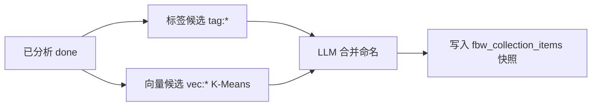

# 智能合集：策展规则与合集页体验（2.0.0+ 增量）

> 文档版本：**v1.0**  
> 整理日期：2026-05-28  
> 状态：**已实现**  
> 关联：[ai-dev-plan.md](./ai-dev-plan.md) · [ai-feature-roadmap.md](./ai-feature-roadmap.md) · [README.md](./README.md)

---

## 1. 概述

本增量在 Sprint 3 基础上完善：

1. **系统自动策展**：入选壁纸改为 **最低评分门槛**（不再用固定 40 条上限）；合集数量上限可在 AI 设置配置。  
2. **合集页**：壁纸列表 **分页加载**；缩略图与搜索页一致（`w=1080`）；卡片 **主色占位** 与探索页一致。  
3. **AI 设置**：`scoreMinFilter`、`autoCollectionsMaxCount` 置于「AI 自动整理合集」开关下方。

---

## 2. 系统自动策展规则

### 2.1 流水线（不变）



实现：`CollectionCurator.mjs`、`VectorCluster.mjs`、`collectionConstants.mjs`。

### 2.2 合集数量

| 项 | 说明 |
|----|------|
| 公式 | `target = clamp(3, round(√已分析数 × 1.2), cap)` |
| 起步 | 至少 **8** 张 `aiAnalysisStatus=done` 才开始生成 |
| 下限 | 至少 **3** 个系统合集（库够大时） |
| 上限 `cap` | **`ai.autoCollectionsMaxCount`**（默认 **20**，可调 **3～50**） |

读取：`resolveAutoCollectionCountMax(ai)`、`computeAutoCollectionCount(analyzed, ai)`。

### 2.3 入选壁纸（按评分，无条数硬顶）

| 项 | 说明 |
|----|------|
| 门槛 | **`ai.scoreMinFilter`**（0～100）；**未设置** = 不按分数过滤 |
| 作用范围 | 标签 SQL、向量簇成员过滤、写入快照前排序 |
| 已移除 | `AUTO_COLLECTION_ITEM_LIMIT`（原每合集最多 40 张） |

同一标签/氛围下，**所有满足分数门槛** 的已分析图均可进入快照（可能很多张，靠合集页分页浏览）。

### 2.4 其他阈值（代码常量）

| 常量 | 值 | 含义 |
|------|-----|------|
| `AUTO_COLLECTION_MIN_TAG_RESOURCES` | 3 | 单标签至少 3 张图才成候选 |
| `AUTO_COLLECTION_MIN_ITEMS` | 3 | 合并后合集至少 3 张 |
| `AUTO_COLLECTION_MIN_EMBEDDINGS` | 8 | 向量聚类至少 8 条 embedding |

### 2.5 触发与刷新

| 触发 | 说明 |
|------|------|
| 分析完成 | ~90s 防抖 → `collectionCurator.run` |
| 向量化完成 | ~60s 防抖 |
| 定时 | 约每 30min |
| 手动 | 合集页「立即整理」；IPC `main:collections:curate` |
| 设置变更 | `autoCollectionsMaxCount` / `scoreMinFilter` 变更 → ~15s 后重新整理 |

系统合集 `refreshMode = on_analysis`；用户合集支持 `manual` / `1h` / `6h` / `12h` / `24h`。

### 2.6 系统合集 `queryJson`（增量字段）

```json
{
  "autoKey": "merged:tag:夜景+vec:0",
  "mergeIds": ["tag:夜景", "vec:0"],
  "tags": ["夜景", "城市"],
  "semanticQuery": "赛博雨夜都市",
  "useSemantic": true,
  "scoreMin": 70,
  "sortField": "score",
  "sortType": -1
}
```

（无 `limitCount`；条数由评分门槛 + 快照全量决定。）

---

## 3. AI 设置（合集相关）

路径：`src/renderer/.../Setting/components/AiSetting.vue` → **功能选项**。

| 控件 | 字段 | 说明 |
|------|------|------|
| 开关 | `autoCollectionsEnabled` | 系统自动整理合集 |
| 子项 · 数字 | `scoreMinFilter` | 最低评分过滤；**不限制** 按钮清空；同时影响 **搜索** 与系统合集 |
| 子项 · 数字 | `autoCollectionsMaxCount` | 仅当自动整理开启时显示；3～50，默认 20 |

子项在开关下方缩进展示（`ai-curate-sub-options`）。

---

## 4. 合集页数据加载

### 4.1 两层请求

| 请求 | 说明 |
|------|------|
| `collectionsList` | 一次返回全部合集元数据 + **`itemCount`**（`GROUP BY` 统计，无壁纸行） |
| `collectionsGet` | **按当前选中合集** 分页拉壁纸 |

**不会**在进入页面时拉取所有合集的全部图片。

### 4.2 `collectionsGet` 分页契约

```javascript
// 请求
{ id, startPage: 1, pageSize: 50 }

// 响应
{
  collection,
  items,      // 当前页
  total,      // 该合集快照总条数
  startPage,
  pageSize
}
```

实现：`CollectionsManager.get(id, { startPage, pageSize })`；默认 `pageSize` 上限 200，默认 50（`COLLECTION_ITEMS_DEFAULT_PAGE_SIZE`）。

### 4.3 前端行为（`Collections.vue`）

| 行为 | 说明 |
|------|------|
| 进入/切换合集 | `startPage=1`，替换 `gridItems` |
| 滚到底 | `VirtualList` `@close-bottom` → 追加下一页 |
| 首屏不足一屏 | `useExploreCardGrid` 计算的 `pageSize` 触发自动补拉一页 |
| 计数 | `ListCountIndicator`：`current / total` |

---

## 5. 合集页展示体验

| 项 | 实现 |
|----|------|
| 缩略图 | `normalizeResourceItem` + `resourceImageUrl.js`：本地图 `?w=1080`，与探索页一致 |
| 卡片主色 | `dominantColor` → `ResourceExploreCard` CSS 变量，加载占位与搜索一致 |
| 组件 | `ResourceExploreCard`（`fill`）；虚拟列表 `VirtualList` |
| 已移除 | `syncCollectionCounts`（列表已带 `itemCount`，勿对 `itemCount===0` 误发全量 `get`） |

---

## 6. 用户自定义合集（对比）

| 维度 | 用户合集 `source=user` | 系统合集 `source=auto` |
|------|------------------------|-------------------------|
| 创建 | NL → `queryJson` → `generate()` 搜索快照 | `CollectionCurator` 策展 |
| 条数上限 | `queryJson.limitCount` 5～50（默认 20） | **仅评分门槛**，无固定条数顶 |
| 刷新 | 用户可选定时 | `on_analysis` + 策展任务 |
| 展示 | 同一套分页 `collectionsGet` | 同左 |

---

## 7. 验收要点

1. **AI 设置**：开启自动整理 → 见「最低评分过滤」「系统推荐合集数量上限」；清空评分为「不限制」。  
2. **策展**：设 `scoreMinFilter=70` → 立即整理 → 系统合集中无低分图；底部 `推荐 n/上限` 的「上限」随设置变。  
3. **分页**：大合集仅首屏请求一页；滚到底加载更多；指示器 `current < total`。  
4. **性能**：合集卡片加载为缩略图（非原图）；占位色随壁纸主色变化。  
5. **列表**：下拉合集名称旁张数与 `collectionsList.itemCount` 一致，切换前无需 N 次 `get`。

---

## 8. 代码锚点

| 模块 | 路径 |
|------|------|
| 策展常量/公式 | `src/main/store/collectionConstants.mjs` |
| 策展逻辑 | `src/main/store/CollectionCurator.mjs` |
| 合集 CRUD/分页 | `src/main/store/CollectionsManager.mjs` |
| 缩略 URL | `src/renderer/utils/resourceImageUrl.js` |
| 条目规范化 | `src/renderer/composables/useResourceCardActions.js` |
| 合集页 | `src/renderer/.../pages/Collections.vue` |
| 卡片 | `src/renderer/components/ResourceExploreCard.vue` |
| 网格分页量 | `src/renderer/composables/useExploreCardGrid.mjs`（`pageSize`） |
| AI 设置 | `AiSetting.vue` |

---

## 9. 修订记录

| 版本 | 日期 | 说明 |
|------|------|------|
| v1.0 | 2026-05-28 | 评分门槛取代条数上限；可配置合集数上限；合集 items 分页；缩略图与主色对齐搜索 |
