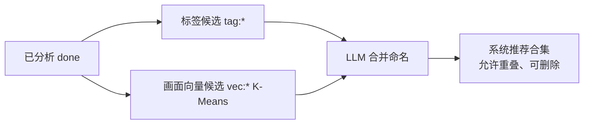

# 飞鸟壁纸 AI 能力开发方案

> 文档版本：**v2.7**  
> 整理日期：2026-05-29  
> 状态：Sprint 0–4 **已落地**；2.0.0 **后续增量已落地**（含找相似方案 C + 远程画面向量）；Sprint 5 **未开发**  
> 应用版本：**1.3.8 → 2.0.0**  
> 关联：[ai-feature-roadmap.md](./ai-feature-roadmap.md) · [ai-visual-embedding-and-similar.md](./ai-visual-embedding-and-similar.md) · [ai-collections-ux-and-curate.md](./ai-collections-ux-and-curate.md) · [ai-analysis-ux-and-performance.md](./ai-analysis-ux-and-performance.md) · [README.md](./README.md)

---

## 确认项

| 项 | 结论 |
|----|------|
| 版本跨度 | DB/功能迁移 `1.3.8_to_2.0.0.mjs`，发版 **2.0.0** |
| Sprint 5（OpenClaw / Agent） | **暂不开发** |
| Sprint 0～4 | **全部开发** |
| 2.0.0 后续增量 | **自动策展、合集页分页/缩略图、评分门槛与可配上限、分析缩图与动态超时、视觉向量找相似、方案 C、合集画面向量**（见 §8～§14 及专题文档） |
| Git | 由用户自行提交 |

---

## 现状对比

### 1.3.8（升级前）

- ONNX 评分 + jieba 分词
- 无 AI Provider、sqlite-vec、智能合集

### 2.0.0（当前）

- **AiAnalysisProvider**（Ollama / OpenAI 兼容 / OpenRouter 等预设）
- **后台分析队列** + 按需单张分析
- **sqlite-vec** + BLOB 降级（`VecStore`）
- **语义搜索**（文本向量）/ **找相似**（**画面优先 RRF** + 文案 boost；内置 MobileCLIP 或 **远程画面向量服务**，`HybridSimilarSearch` + `EmbeddingManager`）
- **智能合集**：用户 NL 创建 + **系统自动策展**（标签 + 向量 + LLM）
- **legacy** 开关：`legacyOnnxScore`、`legacyJiebaTags`
- 探索页：统一顶栏（方案 A）、score 筛选、语义搜索开关（`search.useSemanticSearch`）、AI 标签、分析进度（设置页）
- 视觉分析：**分析前缩图** + **动态超时**（仅 analyze 路径）

---

## 目标架构

```mermaid
flowchart TB
  subgraph ui [渲染进程]
    AiSetting[AiSetting]
    Explore[ExploreCommon]
    Collections[Collections.vue]
  end
  subgraph main [主进程]
    AAM[AiAnalysisManager]
    EM[EmbeddingManager]
    HSS[HybridSimilarSearch]
    ERB[EmbedRequestBuilder]
    IVE[ImageVisualEmbedder]
    CM[CollectionsManager]
    CC[CollectionCurator]
    TS[TaskScheduler]
  end
  subgraph db [SQLite + sqlite-vec]
    RES[fbw_resources]
    VEC[fbw_resource_vec_blob / vec_index]
    IVEC[fbw_resource_image_vec_blob]
    COL[fbw_collections source=user|auto]
  end
  AiSetting --> AAM
  Explore --> EM
  EM --> HSS
  EM --> ERB
  AAM --> IVE
  IVE --> IVEC
  EM --> VEC
  Collections --> CM
  Collections --> CC
  AAM -->|分析完成| CC
  EM -->|文本向量化完成| CC
  TS -->|aiAnalysis / visualEmbed / collectionCurator| AAM
  TS --> EM
  TS --> CC
  CC --> COL
  CM --> COL
```

扫描子进程 **仅** sharp 元数据；AI 分析、embedding、策展均在主进程。

---

## Sprint 0 — 数据层

- `sql.mjs` 新表/新列；`schemaUpgrade.mjs` 旧库补列
- `resources/migrations/1.3.8_to_2.0.0.mjs`
- `fbw_resources`：`summary`、`aiAnalyzedAt`、`nsfwLevel`、`aiAnalysisStatus`
- `fbw_collections` + `fbw_collection_items` + `fbw_resource_embeddings` + vec 索引
- `defaultSettingData.ai`、`enabledMenus` 含 `Collections`

---

## Sprint 1 — AI 基建（P0）

| 模块 | 路径 |
|------|------|
| Provider | `src/main/ai/AiAnalysisProvider.mjs`、`providers/HttpAiProviders.mjs` |
| 分析前缩图 | `AiVisionImagePrep.mjs` |
| 分析调度 | `AiAnalysisManager.mjs` |
| Prompt/解析 | `AiPrompts.mjs`、`AiResponseParser.mjs` |
| 设置 UI | `AiSetting.vue` |
| IPC | `main:analyzeResource`、`main:testAiConnection`、`main:listAiModels`、`main:getAiAnalysisStats` |

改造：扫描去掉子进程 ONNX；`WordsManager.applyTagsFromAnalysis`。

---

## Sprint 2 — Embedding + 搜索（P1）

- `EmbeddingManager.mjs`、`TextQueryParser.mjs`、`VecStore.mjs`（**文本向量**）
- `main:findSimilar`、`main:parseSearchQuery`、`main:semanticSearch`
- ExploreCommon：相似、语义搜索、score 筛选、卡片 **AI 已分析** ✨（`aiAnalysisStatus === done`）

**2.0.0+ 增量（视觉）：** 见 [ai-visual-embedding-and-similar.md](./ai-visual-embedding-and-similar.md)

- `ImageVisualEmbedder.mjs`、`fbw_resource_image_vec_blob`
- `HybridSimilarSearch.mjs`：画面路为主 + 文案 boost（内部阈值，无用户滑块）
- `visualEmbedSource`（builtin \| remote）+ 独立 `visualEmbed*` 服务四件套；`EmbedRequestBuilder.mjs` 多服务商 embed
- 定时 `visualEmbed` 补算；`getAiAnalysisStats.imageEmbedding`

---

## Sprint 3 — 智能合集（P1）

### 3.1 用户自定义合集（`source = user`）

- 用户输入自然语言 → LLM 解析 `queryJson` → `ResourcesManager.search` → 快照
- `CollectionsManager.mjs` + `Collections.vue`
- IPC：`main:collections:list|get|create|update|delete|generate|addAllToFavorites`

### 3.2 系统自动策展（`source = auto`）— **2.0.0 增量**

| 组件 | 说明 |
|------|------|
| `CollectionCurator.mjs` | 三阶段策展主逻辑 |
| `VectorCluster.mjs` | K-Means 向量聚类（余弦距离） |
| `collectionConstants.mjs` | 数量公式、刷新策略、阈值 |
| `buildCollectionMergePrompt` | LLM 合并命名 Prompt |

**流水线：**



**合集数量公式：** `clamp(3, round(√已分析数 × 1.2), cap)`，`cap = ai.autoCollectionsMaxCount`（默认 **20**，可调 **3～50**）；至少 8 张 `done` 才开始。

**入选壁纸：** 按 **`ai.scoreMinFilter`** 过滤（默认 **70**，0～100）；**已取消**每合集固定 40 条上限（`AUTO_COLLECTION_ITEM_LIMIT` 已移除）。

**触发：** 分析完成 ~90s 防抖；文本/**画面**向量化完成 ~60s 防抖；每 30min 定时（**分析队列稳定且已锁存后暂停**）；合集页「立即整理」（**始终可用**）；`scoreMinFilter` / `autoCollectionsMaxCount` 变更 → 清锁存 + ~15s 后重整理；IPC `main:collections:curate`、`main:collections:curatorStats`。

**稳定暂停：** `pending=0` 且 `failed=0` 且非 `running` → 保证 **至少一轮** 自动整理 → 写入 `autoCurateSettled` → 停定时/防抖。实现：`collectionCurateGate.mjs`。详述 [ai-collections-ux-and-curate.md](./ai-collections-ux-and-curate.md) §2.5。

**设置：** `ai.autoCollectionsEnabled`（默认 true）；子项 **`scoreMinFilter`**、**`autoCollectionsMaxCount`**；**`analysisMaxRetries`** / **`concurrency`** 默认 **1**（**已从 `AiSetting.vue` 移除 UI**，逻辑仍生效）；需 `ai.enabled`；分析完成后自动向量化。

**合集页：** `collectionsGet` **分页**；列表缩略 `w=1080`；详述 [ai-collections-ux-and-curate.md](./ai-collections-ux-and-curate.md)。

**自定义合集刷新：** `refreshMode` = `manual` | `1h` | `6h` | `12h` | `24h`；系统合集为 `on_analysis`。用户合集 `generate()`：**关键词 SQL 优先**；实体词 **不走** 画面补充；氛围描述可用 `VisualCollectionSearch`（见 §14）。

**仍未做：** AI-207（合集作壁纸源）。**AI-208b** 已部分实现（画面语义补充，非纯文本 `semanticSearch`）。系统氛围合集 **AI-208a** 已实现（`CollectionCurator` + 画面 K-Means）。

---

## Sprint 4 — 自动化 + 安全 + H5（P2）

- `RecommendManager` 轻量推荐
- `WallpaperManager` smartSwitch、autoDownload 扩词
- 敏感内容 / 评分（`privacy.enableNsfwContentMask`、`scoreMinFilter`；**已移除** `enableNsfwCheck` — 见 [privacy-and-sensitive-content.md](./privacy-and-sensitive-content.md)）
- H5：`/api/ai/*`、`/api/collections/*`

---

## Sprint 5 — 暂不开发

OpenClaw Plugin、AgentBridge、MCP — 见 [openclaw-agent-integration.md](./openclaw-agent-integration.md)

---

## IPC 契约（当前）

| 通道 | 说明 |
|------|------|
| `main:analyzeResource` | 单张分析 |
| `main:testAiConnection` | 测试视觉/文本/文本向量/画面向量（`visual-embed`）；统一 60s 上限 |
| `main:listAiModels` | 拉取模型列表（含用途过滤） |
| `main:getAiAnalysisStats` | 分析进度统计 |
| `main:parseSearchQuery` | NL → 搜索参数 |
| `main:findSimilar` / `main:semanticSearch` | 相似（画面 RRF + boost）/ 语义（文本） |
| `main:collections:*` | 合集 CRUD、generate、收藏；`get` 支持 `{ id, startPage, pageSize }` → `{ items, total, ... }` |
| `main:collections:curate` | 手动触发自动策展（不受稳定锁存限制） |
| `main:collections:curatorStats` | 策展统计（含 `autoCurateSettled`） |
| `main:recommend` | 轻量推荐 |

---

## 设置项 `settingData.ai`（要点）

| 字段 | 说明 |
|------|------|
| `enabled` | 总开关 |
| `analysisMode` | `off` / `on_demand` / `background_slow` / `new_only` |
| `visionPreset` / `textPreset` | Ollama、OpenRouter、OpenAI 等 |
| `autoCollectionsEnabled` | 系统自动策展 |
| `scoreMinFilter` | 最低评分（搜索 + 系统合集选图）；默认 **70**（0～100） |
| `autoCollectionsMaxCount` | 系统推荐合集数量上限（默认 20，3～50） |
| `analysisMaxRetries` | 后台分析单张最大连续失败次数（默认 **1**，1～20）；达上限 → `skipped`；**设置页不展示** |
| `concurrency` | 后台并行分析张数（默认 **1**，1～10）；**设置页不展示** |
| `autoCurateSettled` | 内部：分析稳定后已完成至少一轮自动整理 |
| `autoCurateSettledAnalyzed` | 锁存时的 `done` 张数 |
| ~~`enableNsfwCheck`~~ | **已移除**；由 `privacy.enableNsfwContentMask` 替代 |
| `legacyOnnxScore` / `legacyJiebaTags` | 遗留能力 |
| `visualEmbedSource` | `builtin`（默认）\| `remote`；兼容选项「内置画面向量」 |
| `visualEmbedPreset` … `visualEmbedModel` | 远程画面向量服务（与视觉/文本并列第三套） |
| `SIMILAR_*`（内部） | `SIMILAR_VISUAL_MIN_COSINE=0.72`、`SIMILAR_TEXT_MIN_COSINE=0.62`；**非用户设置** |
| `timeout` | 默认 **300s**（60～1800s）；视觉分析另加动态加成（见下） |
| `visionPreprocess` | 默认 true；`visionMaxLongEdge` 2048 等 |

**`settingData.search`：** `useSemanticSearch` — 探索/H5 筛选；原 `ai.smartSearch` 已迁移删除。

**视觉动态超时：** `min(timeout + min(fileMB×30s, 10min), 1800s)`，实现于 `aiConstants.resolveEffectiveVisionTimeout`。

---

## §8 后续增量（自动策展等）— 已落地

见上文 Sprint 3.2、`CollectionCurator`、VecStore 修复、分析进度侧边栏等（v2.0 文档已述）。

---

## §9 后续增量（合集策展与合集页）— 已落地

> 详述：[ai-collections-ux-and-curate.md](./ai-collections-ux-and-curate.md)

| 项 | 说明 |
|----|------|
| 评分门槛 | 系统合集入选仅 `score >= scoreMinFilter`（默认 70，0～100） |
| 数量上限 | `autoCollectionsMaxCount` 替代写死 12/20 |
| 稳定后暂停 | 分析队列稳定 → 至少一轮自动整理 → `autoCurateSettled`，停 30min/防抖 |
| 合集 items 分页 | `CollectionsManager.get` + `Collections.vue` 滚到底加载 |
| 缩略图 | `resourceImageUrl.js` + `normalizeResourceItem`，与探索一致 |
| 卡片主色 | `ResourceExploreCard` 使用 `dominantColor` |
| 列表 `itemCount` | `collectionsList` 一次统计；移除错误 `syncCollectionCounts` |

---

## §10 后续增量（分析性能与设置 UX）— 已落地

> 详述：[ai-analysis-ux-and-performance.md](./ai-analysis-ux-and-performance.md)

| 项 | 说明 |
|----|------|
| `AiVisionImagePrep` | 大图等比缩 JPEG 再送 VLM；条件跳过小图 |
| 动态超时 | 按文件体积加成，上限 1800s |
| 语义搜索配置 | `settingData.search.useSemanticSearch`；探索筛选开关 |
| `ExploreSearchHeader` | 搜索/收藏/回忆顶栏方案 A |
| `AiSetting` | Tooltip 说明；功能项/分析模式/视觉输入；标签 `auto` 宽度防换行 |
| 可观测 | `[AiVisionPrep]`、`vision-http modelMs`、`preprocess=` 日志 |
| 失败重试上限 | `analysisMaxRetries` + `aiAnalysisFailCount`；达上限 → `skipped` |
| 手动分析 | `analyzeResourceById` 不受重试上限 |

---

## §11 后续增量（分析重试与策展稳定）— 已落地

> 详述：[ai-analysis-ux-and-performance.md](./ai-analysis-ux-and-performance.md) §4.1 · [ai-collections-ux-and-curate.md](./ai-collections-ux-and-curate.md) §2.5

| 项 | 说明 |
|----|------|
| `collectionCurateGate.mjs` | 判断分析队列是否稳定、是否应继续自动整理 |
| `runCollectionCurator` | 自动路径受锁存约束；`manual: true` 不受限 |
| 持久锁存 | `autoCurateSettled` / `autoCurateSettledAnalyzed` 写入设置 DB |
| 动机 | 避免数据不变时每 30min 调 LLM 导致合集名称/分组漂移 |

---

## §12 后续增量（视觉向量与画面找相似）— 已落地

> 详述：[ai-visual-embedding-and-similar.md](./ai-visual-embedding-and-similar.md)

| 项 | 说明 |
|----|------|
| `ImageVisualEmbedder` | MobileCLIP2-S0 ONNX，`resources/models/mobileclip2_s0_vision.onnx` |
| `fbw_resource_image_vec_blob` | 视觉向量存储，512 维（内置）或远程模型维数 |
| `findSimilar` | 初版：画面 KNN；无视觉向量回退文本 |
| `visualEmbed` 任务 | 每 4min 补算最多 4 张；启动约 60s 后首轮 |
| 设置统计 | `embedding`（文本）+ `imageEmbedding`（视觉） |
| 卡片角标 | **未**展示单张向量状态；✨ 仅表示 AI 分析 `done` |

---

## §13 后续增量（找相似方案 C + 远程画面向量）— 已落地

> 详述：[ai-visual-embedding-and-similar.md](./ai-visual-embedding-and-similar.md) v2.0

| 项 | 说明 |
|----|------|
| `HybridSimilarSearch` | 画面路 Top-200 + 内部 0.72 阈值；文案路仅对画面候选 boost（0.12）；RRF k=60 |
| 移除用户设置 | 删除 `findSimilarMode`、`similarMinCosine*`、`visualEmbedEnabled` |
| `visualEmbedSource` | `builtin` \| `remote`；兼容选项开关「内置画面向量」 |
| 独立画面向量服务 | `visualEmbedPreset/BaseUrl/ApiKey/Model`；`resolveServiceProfile('visualEmbed')` |
| `EmbedRequestBuilder` | OpenAI / NVIDIA NIM / OpenRouter / Jina / vLLM 等 embed 方言 |
| 远程失败 | 回退内置 MobileCLIP |
| NVIDIA 兼容 | 文本 `nv-embed-v1` 无 modality；VL 图像 `input` 为 data URI 字符串 + passage |
| 测试连接 | 三处统一「测试连接 / 连接成功」；`AI_TEST_CONNECTION_TIMEOUT_MS=60s`；视觉测用小图 analyze |

---

## §14 后续增量（合集画面向量）— 已落地

> 详述：[ai-collections-ux-and-curate.md](./ai-collections-ux-and-curate.md) · [ai-visual-embedding-and-similar.md](./ai-visual-embedding-and-similar.md) §13

| 项 | 说明 |
|----|------|
| `CollectionCurator` | `vec:*` 聚类改用 `fbw_resource_image_vec_blob`（active visual model） |
| `VisualCollectionSearch` | 用户合集画面语义；远程直 embed / 内置种子→质心 |
| 关键词优先 | `filterKeywords`/`tags` SQL 先于画面；**有结构化关键词时禁用画面补充** |
| `regenPrompt` | 默认 **false**；定时/手动刷新不重跑 NL，避免清空 `filterKeywords` |
| 短 prompt 兜底 | ≤32 字 prompt 视为 `filterKeywords`（实体词合集） |
| `expandCollectionKeywordTags` | LLM 动态扩展 tags（替代已删除的硬编码别名表）；`keywordTagsExpandedFor` 缓存 |
| 覆盖率门槛 | `COLLECTION_VISUAL_MIN_EMBEDDINGS = 12` |
| 触发 | `onVisualEmbeddingDone` → 策展防抖 |
| 修复 | 「汽车」等实体词刷新不再被全库风景覆盖（根因：空关键词 + 高分排序） |

---

## 数据库补充（2.0.0 增量）

| 变更 | 说明 |
|------|------|
| `fbw_collections.source` | `user`（默认）\| `auto` |
| `fbw_collections.refreshMode` | 含 `on_analysis`（系统合集） |
| `queryJson.autoKey` | 系统合集稳定键（`tag:*` / `vec:*` / `merged:*`） |
| `fbw_resources.aiAnalysisFailCount` | 连续分析失败次数（成功归零） |
| VecStore | vec0 **不支持 UPSERT** → DELETE+INSERT；维数变更 DROP 重建 |
| `fbw_resource_image_vec_blob` | 画面向量表（找相似、系统策展、用户合集补充） |

---

## 里程碑

| 版本 | 内容 |
|------|------|
| 2.0.0-dev | Sprint 0+1 |
| 2.0.0-beta | + Sprint 2+3 |
| 2.0.0 | + Sprint 4 |
| 2.0.0+ | 自动策展、合集分页/缩略图、评分与上限可配、VecStore 修复、探索顶栏、分析缩图、动态超时、**视觉向量找相似**、**方案 C + 远程画面向量** |

---

## 实施清单

| 阶段 | 状态 | 主要交付 |
|------|------|----------|
| Sprint 0 | ✅ | 表结构、迁移、`publicData`、i18n |
| Sprint 1 | ✅ | `src/main/ai/*`、AiSetting、IPC、扫描去 ONNX |
| Sprint 2 | ✅ | Embedding、语义/相似、ExploreCommon |
| Sprint 3 | ✅ | CollectionsManager、Collections.vue、IPC |
| Sprint 4 | ✅ | Recommend、H5 API、NSFW/score、扩词 |
| **增量** | ✅ | CollectionCurator、VectorCluster、LLM 合并、定时刷新、分析进度、VecStore 修复 |
| **增量²** | ✅ | 视觉缩图、动态超时、语义搜索迁移、ExploreSearchHeader、AiSetting UX |
| **增量³** | ✅ | 合集评分门槛、可配上限、items 分页、缩略图/主色、AiSetting 合集子项 |
| **增量⁴** | ✅ | MobileCLIP2-S0 视觉向量、画面找相似、双表存储、视觉补算任务 |
| **增量⁶** | ✅ | 合集画面向量：策展 K-Means、用户合集关键词优先 + `VisualCollectionSearch` |
| **增量⁷** | ✅ | 刷新 `regenPrompt` 默认 false；LLM 标签扩展；实体词禁用画面补充 |
| Sprint 5 | ⏸ | OpenClaw/Agent — 仅文档 |

---

## 验收建议（本地）

### 基础 AI

1. 设置 → AI：启用、选 OpenRouter/Ollama、测试连接、保存（有 toast）
2. 分析模式「后台慢速」→ 观察 `getAiAnalysisStats`（pending/done/failed）
3. 探索页：已 `done` 的卡片显示 **AI** 标签（需开启「显示标签」）

### 向量与搜索

4. AI 开启并分析若干张（文本 + 视觉向量化）→「找相似」（画面相近为主）/「智能搜索」（文本语义；探索筛选可开语义搜索）  
4a. 设置进度卡：`已向量化` 与 `已向量化(视觉)` 分别计数；卡片角标 **无** 单张向量状态（见 [ai-visual-embedding-and-similar.md](./ai-visual-embedding-and-similar.md) §9）  
4b. 关闭「内置画面向量」+ 配置远程 Nemotron VL：测试连接成功；找相似仍可用（失败回退内置）

### 智能合集

5. **系统策展**：≥8 张 `done` + ≥8 条 **画面** embedding → 设 `scoreMinFilter` 与 `autoCollectionsMaxCount` →「立即整理」→「AI 推荐」分区 → 后台分析完成后自动整理至少一轮 → 暂停定时  
6. **自定义合集**：实体词（如「汽车」）→ 刷新后仅 SQL/tags，日志 `visual=no`；氛围描述 → 画面语义补充；可选定时刷新  
6a. **标签扩展**：AI 开启时短实体词首次生成/刷新会调 LLM 扩 tags；`keywordTagsExpandedFor` 命中则跳过  
7. **分页**：大合集滚到底加载；指示器 `current/total` 正确
8. **缩略图**：网络/日志中 `imageSrc` 含 `w=1080`（本地 `fbwtp://`）
9. 删除系统合集、关闭 `autoCollectionsEnabled` 验证行为

### 其他

8. H5 API（子进程 DB 单例）
9. VecStore：分析后日志无 `vec upsert 失败`（UPSERT 问题已修）

### 分析性能与设置（增量²）

10. 10MB 级大图：日志 `preprocess=resized`，`modelMs` 相对原图直传应下降或更易在有效超时内完成  
11. 设置 → 视觉输入：关闭缩图后行为与旧版一致（整文件 base64）  
12. 探索 → 筛选：语义搜索开关生效；AI 设置页无 `smartSearch`  
13. 功能选项长标签不换行；ⓘ Tooltip 多行可读  

---

## 已知限制

| 项 | 说明 |
|----|------|
| OpenRouter 免费模型 | 易 429 限流，导致 `done=0`、系统合集无法生成 |
| 分析 prerequisite | 系统策展强依赖 `aiAnalysisStatus=done` 与 AI 标签 |
| sqlite-vec | 各平台需实机验证；失败走 BLOB + 余弦 |
| 视觉向量补算 | 万级图库需较长时间（约 4 张/4min）；找相似前可现场 embed 源图 |
| 找相似 vs 策展 | 均用画面表；语义搜索仍用文本表 |
| 合集关键词为空 | 中英文标签不一致时可用 **LLM 标签扩展**（需 AI 开启）；否则 SQL 0 条、合集可为空 |
| 远程画面向量 | 维数与内置不同，按 `model` 分桶；远程失败回退 512 维内置 |
| NVIDIA 504 | 视觉分析网关超时属服务端问题，非请求格式错误 |
| LLM 合并 | 失败时降级为规则命名，不阻断策展；**锁存前**定时重跑可能因模型非确定性漂移 |
| 分析失败 | 后台达 `analysisMaxRetries` 后 skipped；需手动分析或改模型 |
| build | 渲染端 Vite/Node 版本偶发不兼容（与 AI 无关） |
| legacy | ONNX/jieba 仍可通过开关启用 |
| VLM 耗时 | 后台每轮 5 张串行；大图建议缩图 + 超时 ≥300s |
| 分析前缩图 | 极小字/边界 NSFW 可略逊于原图；可调 `visionMaxLongEdge` |

---

## 修订记录

| 版本 | 日期 | 说明 |
|------|------|------|
| v1.0 | 2026-05-26 | Sprint 0–4 方案；Sprint 5 跳过 |
| v1.1 | 2026-05-26 | 实施清单与验收 |
| **v2.0** | 2026-05-27 | 自动策展（标签+向量+LLM）；合集定时刷新；VecStore 修复；IPC/设置/探索增量；README 索引 |
| v2.1 | 2026-05-27 | §10 分析缩图/动态超时；语义搜索迁移；探索顶栏；设置 Tooltip |
| **v2.2** | 2026-05-28 | §9 合集评分门槛、分页、可配上限；`collectionsGet` 分页契约；链至 ai-collections-ux-and-curate |
| **v2.3** | 2026-05-28 | §11 分析失败重试上限、策展稳定锁存；`scoreMinFilter` 默认 70；`aiAnalysisFailCount` |
| **v2.4** | 2026-05-28 | §12 视觉向量 MobileCLIP2-S0；`ai-visual-embedding-and-similar.md`；验收/清单增量⁴ |
| **v2.5** | 2026-05-29 | §13 方案 C、远程画面向量、EmbedRequestBuilder；移除用户找相似阈值；设置/IPC 同步 |
| **v2.6** | 2026-05-29 | §14 合集画面向量；用户合集关键词优先；`VisualCollectionSearch` |
| **v2.7** | 2026-05-29 | §14 增补：`regenPrompt`、动态标签扩展、实体词禁用画面补充、风景顶替修复 |
| **v2.8** | 2026-05-27 | 移除 `enableNsfwCheck`；`privacy-and-sensitive-content.md`；AI 设置隐藏 `analysisMaxRetries`/`concurrency`（默认 1） |
