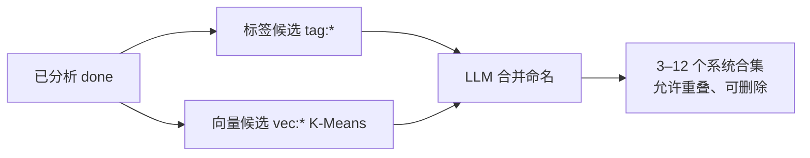

# 飞鸟壁纸 AI 能力开发方案

> 文档版本：**v2.0**  
> 整理日期：2026-05-27  
> 状态：Sprint 0–4 **已落地**；2.0.0 **后续增量已落地**（自动策展等）；Sprint 5 **未开发**  
> 应用版本：**1.3.8 → 2.0.0**  
> 关联：[ai-feature-roadmap.md](./ai-feature-roadmap.md) · [openclaw-agent-integration.md](./openclaw-agent-integration.md) · [README.md](./README.md)

---

## 确认项

| 项 | 结论 |
|----|------|
| 版本跨度 | DB/功能迁移 `1.3.8_to_2.0.0.mjs`，发版 **2.0.0** |
| Sprint 5（OpenClaw / Agent） | **暂不开发** |
| Sprint 0～4 | **全部开发** |
| 2.0.0 后续增量 | **自动策展、VecStore 修复、设置/探索体验增强**（见下文 §8） |
| Git | 由用户自行提交 |

---

## 现状对比

### 1.3.8（升级前）

- ONNX 评分 + jieba 分词
- 无 AI Provider、sqlite-vec、智能合集

### 2.0.0（当前）

- **AiAnalysisProvider**（Ollama / OpenAI 兼容 / OpenRouter 等预设）
- **后台分析队列** + 按需单张分析
- **sqlite-vec** + BLOB 降级（`VecStore`）
- **语义搜索 / 找相似**（`EmbeddingManager`）
- **智能合集**：用户 NL 创建 + **系统自动策展**（标签 + 向量 + LLM）
- **legacy** 开关：`legacyOnnxScore`、`legacyJiebaTags`
- 探索页：score 筛选、AI 标签、分析进度（设置页）

---

## 目标架构

```mermaid
flowchart TB
  subgraph ui [渲染进程]
    AiSetting[AiSetting]
    Explore[ExploreCommon]
    Collections[Collections.vue]
  end
  subgraph main [主进程]
    AAM[AiAnalysisManager]
    EM[EmbeddingManager]
    CM[CollectionsManager]
    CC[CollectionCurator]
    TS[TaskScheduler]
  end
  subgraph db [SQLite + sqlite-vec]
    RES[fbw_resources]
    VEC[fbw_vec_index / BLOB]
    COL[fbw_collections source=user|auto]
  end
  AiSetting --> AAM
  Explore --> EM
  Collections --> CM
  Collections --> CC
  AAM -->|分析完成| CC
  EM -->|向量化完成| CC
  TS -->|aiAnalysis / collectionCurator| AAM
  TS --> CC
  CC --> COL
  CM --> COL
```

扫描子进程 **仅** sharp 元数据；AI 分析、embedding、策展均在主进程。

---

## Sprint 0 — 数据层

- `sql.mjs` 新表/新列；`schemaUpgrade.mjs` 旧库补列
- `resources/migrations/1.3.8_to_2.0.0.mjs`
- `fbw_resources`：`summary`、`aiAnalyzedAt`、`nsfwLevel`、`aiAnalysisStatus`
- `fbw_collections` + `fbw_collection_items` + `fbw_resource_embeddings` + vec 索引
- `defaultSettingData.ai`、`enabledMenus` 含 `Collections`

---

## Sprint 1 — AI 基建（P0）

| 模块 | 路径 |
|------|------|
| Provider | `src/main/ai/AiAnalysisProvider.mjs`、`providers/HttpAiProviders.mjs` |
| 分析调度 | `AiAnalysisManager.mjs` |
| Prompt/解析 | `AiPrompts.mjs`、`AiResponseParser.mjs` |
| 设置 UI | `AiSetting.vue` |
| IPC | `main:analyzeResource`、`main:testAiConnection`、`main:listAiModels`、`main:getAiAnalysisStats` |

改造：扫描去掉子进程 ONNX；`WordsManager.applyTagsFromAnalysis`。

---

## Sprint 2 — Embedding + 搜索（P1）

- `EmbeddingManager.mjs`、`TextQueryParser.mjs`、`VecStore.mjs`
- `main:findSimilar`、`main:parseSearchQuery`、`main:semanticSearch`
- ExploreCommon：相似、语义搜索、score 筛选、卡片 AI 已分析标识（`aiAnalysisStatus === done`）

---

## Sprint 3 — 智能合集（P1）

### 3.1 用户自定义合集（`source = user`）

- 用户输入自然语言 → LLM 解析 `queryJson` → `ResourcesManager.search` → 快照
- `CollectionsManager.mjs` + `Collections.vue`
- IPC：`main:collections:list|get|create|update|delete|generate|addAllToFavorites`

### 3.2 系统自动策展（`source = auto`）— **2.0.0 增量**

| 组件 | 说明 |
|------|------|
| `CollectionCurator.mjs` | 三阶段策展主逻辑 |
| `VectorCluster.mjs` | K-Means 向量聚类（余弦距离） |
| `collectionConstants.mjs` | 数量公式、刷新策略、阈值 |
| `buildCollectionMergePrompt` | LLM 合并命名 Prompt |

**流水线：**



**合集数量公式：** `clamp(3, round(√已分析数 × 1.2), 12)`，至少 8 张 `done` 才开始。

**触发：** 分析完成 ~90s 防抖；向量化完成 ~60s 防抖；每 30min 定时；合集页「立即整理」；IPC `main:collections:curate`、`main:collections:curatorStats`。

**设置：** `ai.autoCollectionsEnabled`（默认 true），需同时 `ai.enabled` + `enableEmbedding`（向量簇依赖 embedding）。

**自定义合集刷新：** `refreshMode` = `manual` | `1h` | `6h` | `12h` | `24h`；系统合集为 `on_analysis`。

**仍未做：** AI-207（合集作壁纸源）、**AI-208b**（用户 NL 合集语义扩召回）。系统氛围合集 **AI-208a** 已实现（`CollectionCurator`）。

---

## Sprint 4 — 自动化 + 安全 + H5（P2）

- `RecommendManager` 轻量推荐
- `WallpaperManager` smartSwitch、autoDownload 扩词
- NSFW / score 筛选（`enableNsfwCheck`、`scoreMinFilter`）
- H5：`/api/ai/*`、`/api/collections/*`

---

## Sprint 5 — 暂不开发

OpenClaw Plugin、AgentBridge、MCP — 见 [openclaw-agent-integration.md](./openclaw-agent-integration.md)

---

## IPC 契约（当前）

| 通道 | 说明 |
|------|------|
| `main:analyzeResource` | 单张分析 |
| `main:testAiConnection` | 测试视觉/文本/向量 |
| `main:listAiModels` | 拉取模型列表（含用途过滤） |
| `main:getAiAnalysisStats` | 分析进度统计 |
| `main:parseSearchQuery` | NL → 搜索参数 |
| `main:findSimilar` / `main:semanticSearch` | 相似 / 语义 |
| `main:collections:*` | 合集 CRUD、generate、收藏 |
| `main:collections:curate` | 手动触发自动策展 |
| `main:collections:curatorStats` | 策展统计（已分析/向量/系统合集数） |
| `main:recommend` | 轻量推荐 |

---

## 设置项 `settingData.ai`（要点）

| 字段 | 说明 |
|------|------|
| `enabled` | 总开关 |
| `analysisMode` | `off` / `on_demand` / `background_slow` / `new_only` |
| `visionPreset` / `textPreset` | Ollama、OpenRouter、OpenAI 等 |
| `enableEmbedding` | 向量索引 |
| `autoCollectionsEnabled` | 系统自动策展 |
| `enableNsfwCheck` | 探索安全筛选 |
| `legacyOnnxScore` / `legacyJiebaTags` | 遗留能力 |
| `timeout` | 默认 120s |

---

## 数据库补充（2.0.0 增量）

| 变更 | 说明 |
|------|------|
| `fbw_collections.source` | `user`（默认）\| `auto` |
| `fbw_collections.refreshMode` | 含 `on_analysis`（系统合集） |
| `queryJson.autoKey` | 系统合集稳定键（`tag:*` / `vec:*` / `merged:*`） |
| VecStore | vec0 **不支持 UPSERT** → DELETE+INSERT；维数变更 DROP 重建 |

---

## 里程碑

| 版本 | 内容 |
|------|------|
| 2.0.0-dev | Sprint 0+1 |
| 2.0.0-beta | + Sprint 2+3 |
| 2.0.0 | + Sprint 4 |
| 2.0.0+ | 自动策展、VecStore 修复、AI 设置/探索体验 |

---

## 实施清单

| 阶段 | 状态 | 主要交付 |
|------|------|----------|
| Sprint 0 | ✅ | 表结构、迁移、`publicData`、i18n |
| Sprint 1 | ✅ | `src/main/ai/*`、AiSetting、IPC、扫描去 ONNX |
| Sprint 2 | ✅ | Embedding、语义/相似、ExploreCommon |
| Sprint 3 | ✅ | CollectionsManager、Collections.vue、IPC |
| Sprint 4 | ✅ | Recommend、H5 API、NSFW/score、扩词 |
| **增量** | ✅ | CollectionCurator、VectorCluster、LLM 合并、定时刷新、分析进度、VecStore 修复 |
| Sprint 5 | ⏸ | OpenClaw/Agent — 仅文档 |

---

## 验收建议（本地）

### 基础 AI

1. 设置 → AI：启用、选 OpenRouter/Ollama、测试连接、保存（有 toast）
2. 分析模式「后台慢速」→ 观察 `getAiAnalysisStats`（pending/done/failed）
3. 探索页：已 `done` 的卡片显示 **AI** 标签（需开启「显示标签」）

### 向量与搜索

4. 开启「向量索引」→ 分析若干张 →「找相似 / 智能搜索」

### 智能合集

5. **系统策展**：≥8 张 `done` + ≥8 条 embedding → 合集页「立即整理」→ 出现「AI 推荐」分区
6. **自定义合集**：输入描述 → 生成 → 可选定时刷新策略
7. 删除系统合集、关闭 `autoCollectionsEnabled` 验证行为

### 其他

8. H5 API（子进程 DB 单例）
9. VecStore：分析后日志无 `vec upsert 失败`（UPSERT 问题已修）

---

## 已知限制

| 项 | 说明 |
|----|------|
| OpenRouter 免费模型 | 易 429 限流，导致 `done=0`、系统合集无法生成 |
| 分析 prerequisite | 系统策展强依赖 `aiAnalysisStatus=done` 与 AI 标签 |
| sqlite-vec | 各平台需实机验证；失败走 BLOB + 余弦 |
| LLM 合并 | 失败时降级为规则命名，不阻断策展 |
| build | 渲染端 Vite/Node 版本偶发不兼容（与 AI 无关） |
| legacy | ONNX/jieba 仍可通过开关启用 |

---

## 修订记录

| 版本 | 日期 | 说明 |
|------|------|------|
| v1.0 | 2026-05-26 | Sprint 0–4 方案；Sprint 5 跳过 |
| v1.1 | 2026-05-26 | 实施清单与验收 |
| **v2.0** | 2026-05-27 | 自动策展（标签+向量+LLM）；合集定时刷新；VecStore 修复；IPC/设置/探索增量；README 索引 |
