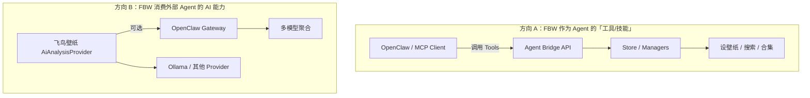

# 外部 Agent 平台集成分析（OpenClaw 及同类产品）

> 文档版本：v1.0  
> 整理日期：2026-05-26  
> 状态：**规划稿 — 未编码**（Sprint 5 明确跳过，见 [ai-dev-plan.md](./ai-dev-plan.md)）  
> 关联文档：[ai-feature-roadmap.md](./ai-feature-roadmap.md) · [README.md](./README.md)

---

## 1. 背景说明

本文以 **[OpenClaw](https://github.com/openclaw/openclaw)**（开源个人 AI 助手 / Agent 框架）为主分析对象，同时覆盖 **MCP、Open WebUI、LocalAI、自动化平台** 等同类集成模式，避免架构只绑死单一产品。

### 1.1 OpenClaw 是什么

| 维度 | 说明 |
|------|------|
| 定位 | 本地优先的个人 AI 助手，Gateway 作为控制面 |
| 交互 | CLI、WebChat、Telegram / Discord / 飞书等频道 |
| 扩展 | **Tools**（可调用函数）、**Skills**（`SKILL.md` 工作流）、**Plugins**（`openclaw.plugin.json` + SDK） |
| 能力 | 浏览器、文件、Shell、Cron、多 Agent 路由、Canvas 等 |
| 默认端口 | Gateway 常见 `127.0.0.1:18789`（须 localhost + Token，禁止裸奔公网） |

### 1.2 与飞鸟壁纸的关系（两种方向）



**结论：**

- **方向 A 是主价值** — 用户在 Telegram 说「帮我换一张蓝色海洋横屏壁纸」，OpenClaw 调 FBW 工具完成。
- **方向 B 是可选** — 若用户已部署 OpenClaw 统一管理模型，FBW 可把其当作 OpenAI 兼容上游之一；**不应替代**内置 `AiAnalysisProvider` 的默认路径。

---

## 2. 为什么要做（产品价值）

| 价值 | 说明 |
|------|------|
| 多渠道控制 | 微信/Telegram/Slack 发一句话设壁纸，不必开桌面客户端 |
| 与内置助手分工 | 内置 AI 助手服务普通用户；OpenClaw 服务极客与自动化玩家 |
| 工作流编排 | OpenClaw Cron：「每天早上 8 点换一张励志壁纸」 |
| 生态曝光 | ClawHub / npm 插件分发，降低获客与集成成本 |
| 标准复用 | 同一套 Tool 定义可同时服务 OpenClaw、MCP、n8n |

---

## 3. 核心原则（避免走弯路）

### 3.1 不要直接暴露 IPC

当前渲染进程通过 `window.FBW` → `ipcRenderer.invoke('main:*')` 与主进程通信。**外部 Agent 无法也不应直接调 IPC**。

应新增：**Agent Bridge 层**（HTTP API 或 MCP Server），由主进程鉴权后转发到现有 Manager。

### 3.2 一套 Tool Registry，多种对外协议

```
AgentToolRegistry（内部唯一真相源）
    ├── OpenClaw Plugin（registerTool）
    ├── MCP Server（tools/list + tools/call）
    ├── H5 Agent API（/api/agent/*，扩展现有 h5_server）
    └── 内置 AiAssistantManager（P3，同 Registry）
```

避免为 OpenClaw 单独写一套业务逻辑。

### 3.3 内置 AI ≠ 外部 Agent

| 能力 | 内置 AiAnalysisProvider | 外部 OpenClaw |
|------|-------------------------|---------------|
| 用户 | 所有用户 | 自行部署 Agent 的用户 |
| 安装 | 零额外依赖 | 需安装 OpenClaw + 配置 |
| 场景 | 评分、标签、合集、应用内助手 | 跨应用、跨频道、Cron、Shell |
| 关系 | 可并存 | FBW 提供 Tools，Agent 提供编排 |

### 3.4 安全默认收紧

OpenClaw 类 Agent 权限极大（文件/Shell/浏览器）。FBW 集成必须：

- 默认 **关闭** Agent API，设置里显式开启
- 仅绑定 `127.0.0.1` 或用户配置的局域网 IP
- **Bearer Token** 或 mTLS
- 危险操作（删文件、清库、改隐私密码）需 **二次确认** 或禁止 Agent 调用
- 审计日志（谁、何时、调了哪个 tool、参数摘要）
- 与 OpenClaw 官方建议一致：`gateway.mode=local`，Token 认证，不暴露 18789 到公网

---

## 4. 需要在飞鸟壁纸内建设的能力

### 4.1 Agent Bridge（主进程新模块）

**建议类名：** `AgentBridgeManager` 或 `ExternalAgentManager`

**职责：**

| 职责 | 说明 |
|------|------|
| Tool 注册表 | 定义 name、description、JSON Schema、riskLevel、handler |
| 请求路由 | HTTP/MCP → 校验 → 调用 `ResourcesManager` / `WallpaperManager` 等 |
| 鉴权 | Token、可选 IP 白名单 |
| 限流 | 防止 Agent 循环调用打满磁盘/网络 |
| 确认队列 | 高危操作返回 `pending_confirmation`，用户 UI 或 H5 确认后执行 |
| 事件推送 | SSE/Webhook：壁纸已切换、扫描完成、合集已生成 |

**部署形态（二选一或并存）：**

| 形态 | 优点 | 缺点 |
|------|------|------|
| 扩展现有 H5 Server | 复用 Koa、已有 search/favorites | 与手机 H5 混用需路径与权限分离 |
| 独立 Agent Server 端口 | 权限模型清晰 | 多一个监听端口 |

**推荐：** Phase 1 在 `h5_server` 增加 `/api/agent/v1/*` + 独立 Token；Phase 2 若安全需求升高再拆独立进程。

### 4.2 Agent Tool 清单（建议 v1）

按风险分级：

#### 低风险（只读 / 可自动执行）

| Tool | 说明 | 映射现有能力 |
|------|------|--------------|
| `fbw_get_status` | 应用版本、当前壁纸、H5/Agent 是否开启 | 新聚合接口 |
| `fbw_search_wallpapers` | 搜索本地/远程壁纸 | `ResourcesManager.search` |
| `fbw_get_resource_detail` | 单条资源 metadata（含 score/tags/summary） | DB 查询 + AI 字段 |
| `fbw_find_similar` | 相似壁纸（sqlite-vec） | 新接口 |
| `fbw_list_collections` | 列出智能合集 | `CollectionsManager` |
| `fbw_get_collection_items` | 合集内资源 | 新接口 |
| `fbw_list_favorites` | 收藏列表 | 现有 favorites 查询 |
| `fbw_get_hot_tags` | 热词/标签 | `getHotTags` / tags 聚合 |
| `fbw_get_words` | 标签库统计 | `WordsManager.getWords` |

#### 中风险（改变壁纸/收藏，建议可配置是否允许 Agent）

| Tool | 说明 | 映射 |
|------|------|------|
| `fbw_set_wallpaper` | 设指定资源为壁纸 | `setAsWallpaperWithDownload` |
| `fbw_next_wallpaper` / `fbw_prev_wallpaper` | 切换 | `WallpaperManager` |
| `fbw_add_favorite` / `fbw_remove_favorite` | 收藏管理 | favorites IPC |
| `fbw_create_collection` | 创建智能合集 | `CollectionsManager` |
| `fbw_refresh_collection` | 重新生成合集 | 新接口 |
| `fbw_toggle_auto_switch` | 开关自动切换 | 现有 IPC |
| `fbw_analyze_resource` | 触发单张 AI 分析 | `AiAnalysisProvider` |
| `fbw_download_wallpaper` | 下载远程图入库 | `downloadFile` |

#### 高风险（默认禁止 Agent 或必须 UI 确认）

| Tool | 说明 |
|------|------|
| `fbw_delete_file` | 删本地文件 |
| `fbw_clear_db` | 清库 |
| `fbw_update_setting` | 改全局设置（含 AI 密钥） |
| `fbw_install_plugin` | 装插件 |
| `fbw_update_privacy_password` | 改隐私密码 |

### 4.3 设置项扩展（`settingData.agent`）

```json
{
  "agent": {
    "enabled": false,
    "listenHost": "127.0.0.1",
    "port": 0,
    "authToken": "",
    "allowLanAccess": false,
    "allowedTools": ["fbw_search_wallpapers", "fbw_set_wallpaper"],
    "requireConfirmFor": ["fbw_set_wallpaper", "fbw_download_wallpaper"],
    "rateLimitPerMinute": 60,
    "webhookUrl": "",
    "openclaw": {
      "autoRegister": false,
      "gatewayUrl": "http://127.0.0.1:18789",
      "gatewayToken": ""
    }
  }
}
```

UI：设置 → **外部 Agent / OpenClaw** — 开关、复制 Token、一键复制 OpenClaw 配置片段、Tool 权限勾选。

### 4.4 事件与 Webhook

Agent 编排依赖「发生了什么」：

| 事件 | 用途 |
|------|------|
| `wallpaper.changed` | OpenClaw Cron 回调、日志 |
| `resource.scanned` | 扫描完成后自动 analyze |
| `collection.generated` | 通知用户 |
| `ai.analysis.completed` | 外部工作流继续 |

现有 H5 **SSE**（`/api/events`）可扩展 `agentEvent` 类型；可选 `POST webhookUrl` 推送到 OpenClaw 或 n8n。

### 4.4 OpenAPI / Tool Schema 文档

外部集成需要机器可读契约：

- 发布 `docs/agent-api.openapi.yaml` 或 JSON Schema 目录
- 每个 Tool 一份 schema，供 OpenClaw Plugin、MCP、Open WebUI 共用

---

## 5. OpenClaw 专项：需要交付什么

### 5.1 推荐交付物（独立仓库或 monorepo 子包）

```
flying-bird-wallpaper-openclaw/
├── openclaw.plugin.json      # 插件清单
├── src/
│   └── index.ts              # definePluginEntry + registerTool
├── skills/
│   └── fbw-wallpaper/
│       └── SKILL.md          # Agent 工作流说明
├── package.json
└── README.md
```

### 5.2 Plugin 注册 Tools

通过 OpenClaw Plugin SDK `api.registerTool(...)` 注册 §4.2 中的工具。  
Tool 实现内部 **HTTP 调用** FBW Agent Bridge（`http://127.0.0.1:{port}/api/agent/v1/tools/call`），不在 Plugin 内重复业务逻辑。

### 5.3 SKILL.md 示例工作流

Skills 教 Agent **何时、如何组合 Tools**（OpenClaw 不替你做业务）：

| Skill 场景 | 指令要点 |
|------------|----------|
| 设壁纸 | 先 `fbw_search_wallpapers` → 用户确认或取 top1 → `fbw_set_wallpaper` |
| 创建合集 | 解析用户描述 → `fbw_create_collection` → `fbw_refresh_collection` |
| 每日壁纸 | 配合 OpenClaw Cron + `fbw_search` + `fbw_set_wallpaper` |
| 相似推荐 | `fbw_find_similar` + 展示 summary |

Skill 中声明：

```yaml
requires:
  config: ["plugins.fbw.baseUrl", "plugins.fbw.token"]
metadata:
  openclaw:
    requires:
      bins: []  # 不要求 openclaw 侧额外二进制
```

### 5.4 与 OpenClaw Gateway 的协作方式

| 模式 | 做法 |
|------|------|
| FBW → OpenClaw（AI 上游） | `AiAnalysisProvider` 增加 `provider: openclaw`，`baseUrl` 指向 Gateway 的 OpenAI 兼容端点（若 Gateway 暴露） |
| OpenClaw → FBW（控制壁纸） | Plugin Tools 调 FBW Agent API（主模式） |
| 共存 | 用户本机 Ollama 给 FBW 分析；OpenClaw 负责 Telegram 设壁纸 — 两者通过 localhost 通信 |

### 5.5 安装与发现

- npm 包名建议：`@oxoyo/openclaw-plugin-flying-bird-wallpaper`
- 文档：`openclaw plugins install npm:@oxoyo/openclaw-plugin-flying-bird-wallpaper`
- 可选上架 ClawHub
- FBW 设置页「检测到 OpenClaw」：探测 `127.0.0.1:18789` 健康检查（仅 localhost）

---

## 6. 同类产品：同一套 Bridge 如何复用

| 产品/协议 | 集成方式 | FBW 需做 |
|-----------|----------|----------|
| **OpenClaw** | Native Plugin + Skills | Plugin 包 + SKILL.md |
| **MCP**（Claude Desktop、Cursor 等） | MCP Server（stdio 或 SSE） | `@modelcontextprotocol/sdk` 包装同一 Tool Registry |
| **Open WebUI** | OpenAPI Tools / Function Calling | 暴露 OpenAPI，用户在 Open WebUI 填 URL+Key |
| **LocalAI / Ollama** | 仅 AI 推理 | 已有 `AiAnalysisProvider`，非 Agent 控制 |
| **n8n / Node-RED** | Webhook + HTTP Request | Agent Bridge REST + 事件 Webhook |
| **Home Assistant** | REST + 可选 MQTT | 封装 `fbw_set_wallpaper` 等少量 REST |
| **Codex/Cursor 插件包** | OpenClaw 兼容 bundle 格式 | 提供 SKILL.md + 命令说明（低优先级） |

**优先顺序：** OpenClaw Plugin ≈ MCP Server > OpenAPI > 其他。

MCP 与 OpenClaw Plugin 可共享 **同一份 Tool 定义 JSON**，两个薄适配层即可。

---

## 7. 与现有 AI 路线图的关系

| ai-feature-roadmap 项 | 外部 Agent 关系 |
|------------------------|-----------------|
| AiAnalysisProvider | Agent 可触发 `fbw_analyze_resource`；分析仍走 FBW 内部队列 |
| 智能合集 Collections | Agent 通过 `fbw_create_collection` 创建，UI 与 Agent 共用 `CollectionsManager` |
| sqlite-vec 相似搜索 | 暴露 `fbw_find_similar` |
| 内置 AI 助手 P3 | **必须**与 AgentToolRegistry 共用，避免两套 function 定义 |
| H5 无语音 | 不受影响；Agent 走文字频道 |

**实施顺序建议：**

1. Phase 0–1：AiAnalysisProvider + Collections（无 OpenClaw 依赖）
2. **Phase 2.5**：AgentToolRegistry + Agent Bridge API + 设置页
3. Phase 3：内置助手接入同一 Registry
4. **Phase 3.5**：OpenClaw Plugin + SKILL.md + MCP Server（可选）
5. Phase 4：Webhook、OpenClaw 检测、ClawHub 发布

---

## 8. 安全清单（必做）

| # | 项 |
|---|-----|
| S1 | Agent API 默认 `enabled: false` |
| S2 | 默认 `127.0.0.1`，`allowLanAccess` 默认 false |
| S3 | 强随机 Token，支持轮换 |
| S4 | 高危 Tool 默认不在 `allowedTools` |
| S5 | 设壁纸/下载/删除写 audit log |
| S6 | 限流 + 单次 search `pageSize` 上限 |
| S7 | 不向 Agent 返回完整 `apiKey` / 隐私密码 |
| S8 | 文档警示：勿将 Agent Gateway 暴露公网 |
| S9 | CORS：Agent 路由不用 `Access-Control-Allow-Origin: *`（H5 现有 SSE 需分路由处理） |

---

## 9. 待建设文件/模块清单

| 模块 | 路径建议 | 说明 |
|------|----------|------|
| AgentToolRegistry | `src/main/agent/AgentToolRegistry.mjs` | Tool 定义与 handler |
| AgentBridgeManager | `src/main/agent/AgentBridgeManager.mjs` | 鉴权、限流、确认队列 |
| Agent API 路由 | `src/main/child_server/h5_server/api/agent.mjs` | `/api/agent/v1/*` |
| 设置 UI | `Setting/components/AgentIntegration.vue` | 开关、Token、Tool 权限 |
| OpenAPI | `docs/agent-api.openapi.yaml` | 对外契约 |
| OpenClaw 插件 | 独立 repo | Plugin + Skills |
| MCP Server | `packages/fbw-mcp-server/`（可选） | stdio 入口 |
| i18n | `zh-CN` / `en-US` | 设置与错误文案 |

---

## 10. 验收标准（OpenClaw 集成 MVP）

1. FBW 开启 Agent API，生成 Token  
2. 安装 OpenClaw Plugin，配置 `baseUrl` + `token`  
3. 在 OpenClaw CLI / WebChat 发送：「搜索本地库里的夜景壁纸并设第一张」  
4. Agent 依次调用 `fbw_search_wallpapers` → `fbw_set_wallpaper` 成功  
5. 桌面壁纸实际切换，FBW 审计日志有记录  
6. 未授权 Token 请求返回 401  
7. 禁用 `fbw_set_wallpaper` 后 Agent 只能搜索不能设壁纸  

---

## 11. 风险与边界

| 风险 | 说明 |
|------|------|
| OpenClaw API 变更 | Plugin 独立版本化；Tool HTTP 契约稳定 |
| 用户误暴露端口 | 文档 + 设置页警告 + 默认 localhost |
| Agent 幻觉乱设壁纸 | Skill 要求先 search 展示 ID；可选「确认后再 set」 |
| 与 H5 端口冲突 | Agent 路由独立前缀 + 独立 Token |
| 维护成本 | Tool 数量 v1 控制在 15 个以内，只读优先 |

---

## 12. 修订记录

| 版本 | 日期 | 说明 |
|------|------|------|
| v1.0 | 2026-05-26 | 初稿：OpenClaw 及 MCP 等同类集成分析 |
