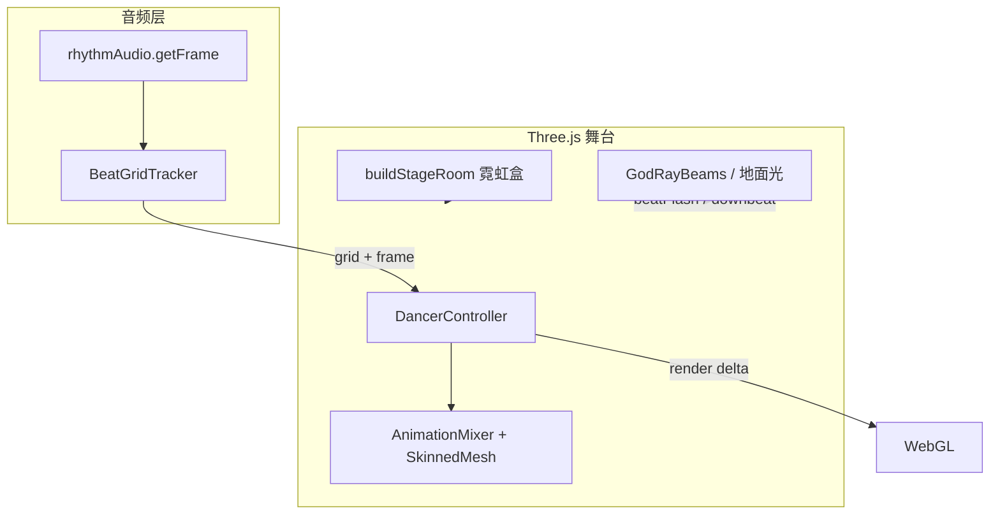

# 律动壁纸：Three.js 中央舞者效果 — 可行性、真实感与 ★★★★ 技术清单

> 临时文档，供后续实现参考。与 **AI 2.0 无直接依赖**。  
> 索引：[README.md](./README.md) · 正式实现文档：[rhythm_wallpaper.md](../rhythm_wallpaper.md) · 音频节拍分析：[rhythm-audio-processing-analysis.md](./rhythm-audio-processing-analysis.md)

---

## 1. 需求与结论摘要

### 1.1 需求描述

舞台中央一个女生随音律跳舞 — Three.js 律动效果。

### 1.2 总体结论

**可以实现，且与现有律动壁纸架构高度契合**；但「随音律跳舞」需拆成两层预期：

| 预期层级 | 含义 | 可行性 |
|---------|------|--------|
| **A. 节拍响应式跳舞** | 角色循环舞蹈，鼓点/低频驱动速度、幅度、切动作、舞台灯光 | **可行**，中等工程量 |
| **B. 真·跟曲编舞** | 像 MV 一样与具体 BGM 编舞对齐、小节切换 | **极难**，需 BPM/小节网格 + 动作库 + 曲风适配，不适合作为壁纸 MVP |

**推荐走 A 路线**，并把真实感目标定为 **「动捕级肢体 + 节拍 accent + 相位对齐」**，而非「懂音乐的编舞」。

### 1.3 真实感核心判断

> **舞蹈动作是否真实？**

- **肢体动作本身**：用动捕资产，**可以做到「看起来是真人跳的」**（约 7/10）。
- **与音乐同步的真实感**：仅用现有 beat 脉冲，**长期看会假**（重复、漂移、切动作生硬）——这是最大风险。
- **整体舞台感**：配合现有霓虹舞台 + 追光，**「表演真实」>「编舞真实」**，用户接受度可能更高。

**★★★★ 不靠更贵的模型**，而靠 **in-place 动捕资产 + BeatGrid 相位 + Base/Additive 分层 + 简单 Foot IK** 四件套；进一步降低重复感、提升曲风贴合见 **§15 DanceScript（DanceChat 启发）**。

---

## 2. 现有基础设施

### 2.1 架构（as-is）

```text
系统音频 → Web Audio API → rhythmAudio.getFrame() → Three 舞台效果 → 桌面律动壁纸
```

| 模块 | 路径 | 职责 |
|------|------|------|
| 窗口与绘制循环 | `RhythmWallpaperWindow/containers/RhythmWallpaperWindow.vue` | rAF、`getFrame()` 驱动 render |
| 音频分析 | `utils/rhythmAudio.js` | 频谱 + kick + beat + beatPulse |
| 舞台基类 | `effects/base/ThreeStageBase.js` | Scene / Camera / Renderer / 分层 |
| 舞台效果基类 | `effects/three/stage/core/StageEffectBase.js` | 霓虹盒、相机 fit、地板对齐 |
| 律动增益 | `effects/three/stage/core/rhythmDrive.js` | `getRhythmGain`、`getBeatFlash` |
| 当前效果 | `ThreeStageBars` / `Wall` / `Grid` / `TexturedSphere` | 几何体 + Shader，无骨骼动画 |

### 2.2 已有能力（约 70% 底座）

- **舞台空间**：`layerBack` / `layerMid` / `layerFront` 分层；`buildStageRoom` 霓虹房间；`stageLayoutProfile` 超宽屏适配。
- **音频特征**：`beat`、`beatPulse`、`kickEnvelope`、`bands`、`silent` 等，比纯频谱更适合驱动人物。
- **Three.js**：`three@0.179.1`，支持 `GLTFLoader` + `AnimationMixer` + `SkinnedMesh`。

### 2.3 当前缺口

- 全项目 **无 GLTF/FBX/AnimationMixer/SkinnedMesh** 相关代码。
- 渲染循环部分效果用固定 `this.time += 0.016`，未统一真实 `deltaTime`。
- 音频侧是 **Kick 检测 + 脉冲衰减**，**无 BPM 相位 / 小节网格**（详见 [rhythm-audio-processing-analysis.md](./rhythm-audio-processing-analysis.md)）。

### 2.4 rhythmAudio 帧结构（摘录）

`getFrame()` 当前返回字段包括：

```javascript
{
  spectrum, bands,
  beat, onset,
  energy, flux, onsetStrength, rms,
  bass, kick, kickEnvelope, bassEnvelope,
  beatPulse, silent
}
```

---

## 3. 技术路线对比

| 方案 | 真实感 | 说明 | 建议 |
|------|--------|------|------|
| **A. 骨骼动画 + 音频驱动** | 中高 | Mixamo/VRM glTF + Mixer + 节拍调制 | **推荐** |
| **B. 程序化骨骼 / IK** | 低 | 数学驱动关节，像机械人 | 不推荐 |
| **C. 2D 视频 / Billboard** | 动作高、融合差 | 包体大，非真 3D | 仅 Demo |
| **D. AI 实时动捕** | 理论高 | 算力/延迟/稳定性不适合 24/7 壁纸 | 不可行 |

### 3.1 方案 A 细分真实感

| 实现深度 | 真实感（壁纸场景） | 说明 |
|---------|-------------------|------|
| 单 Mixamo 循环 + beat 调速 | ★★★☆☆ | 像人在跳，但重复、易漂移 |
| 多 clip + crossfade + foot IK | ★★★★☆ | 接近「舞台通用舞」，仍非编舞 |
| + BPM 相位 + additive accent | ★★★★☆+ | 踩点感明显提升 |
| MV 级「每首歌都像专门编舞」 | ★★★★★ | **不现实**作通用壁纸 |

---

## 4. 「随音律跳舞」能到什么程度

### 4.1 容易做好的（A 级体验）

- 鼓点瞬间：`beat === true` → accent（下蹲、甩手、短 clip 叠加）
- 持续强度：`beatPulse` / `kickEnvelope` → 根节点 Y 弹跳、舞台光闪（**lock 后不调 clip 速度**）
- 频段分工：`bands.low` 驱身体，`bands.mid/high` 驱手臂 accent 权重
- 静音：`silent` → 切 idle，避免无音乐时尬舞

### 4.2 难做好的（B 级体验）

- 与 **BPM 对齐** 的步点（需 BPM 估计 + 相位跟踪）
- 不同曲风统一「像在编舞」
- 长镜头下动作不重复、不穿模

### 4.3 真实感的三个维度

| 维度 | 用户感受 | 能否达到 |
|------|----------|----------|
| **生物真实** | 关节、重心、肢体像真人 | 动捕资产 → **可以** |
| **音乐真实** | 每个鼓点都对上动作 | BPM + 相位 → **难，但 Phase 2 可大幅改善** |
| **表演真实** | 像舞台表演，有张力 | 灯光 + 多动作 + accent → **部分可以** |

壁纸场景里，用户更常注意到 **「脚滑 / 重复 / 没踩点」**，而不是「肘关节角度差 5°」。

---

## 5. 概念架构

```text
RhythmWallpaperWindow.draw()
  └─ rhythmAudio.getFrame()          // 已有，需扩展 grid
       └─ DancerController.update()  // 新增核心
            ├─ BeatGridTracker      // BPM + 相位
            ├─ MotionLayerStack     // Base + Additive
            ├─ FootIKSolver         // 锁脚
            ├─ TransitionBlender    // crossfade 规则
            └─ AnimationMixer       // Three.js 标准
```



建议新增 `ThreeStageDancer extends StageEffectBase`：

- `initStage()`：建房间 + 加载 glTF + 绑定 Mixer
- `render(frame)`：更新 grid → DancerController → `renderScene()`
- `destroy()`：dispose 几何/材质/动画

角色放置：`layerMid`，位置约 `(0, floorY, stageZ)`，scale 按 `visibleH` / `roomH` 适配。

---

## 6. ★★★★ 最小技术清单

### 6.1 目标定义

在**不做 AI 动捕、不做 per-song 编舞**的前提下：

- **肢体**：像真人动捕（无明显关节反折、比例正常）
- **地面**：脚不飘、不滑（in-place + 简单 Foot IK）
- **节奏**：强拍有 accent，30–60 秒内不明显「踩点漂移」
- **过渡**：切动作不瞬移、不卡在半势

产品表述建议：**「舞台动捕舞者 + 智能踩点 accent」**，不要写「AI 编舞」。

---

### 6.2 资产规格

#### 模型与动作来源

| 项 | 要求 |
|----|------|
| 来源 | Mixamo mocap 或商业 mocap，禁止手 K 主舞 |
| 格式 | glTF 2.0（`.glb`），单文件优先 |
| 面数 | ≤ 25k tri（壁纸常驻） |
| 骨骼 | ≤ 65 bones |
| 贴图 | 1×2K 主体 + 可选 1×1K 头发 |
| 比例 | 身高约 1.65–1.75 m（与 `roomH` 对齐） |

#### 动作库（最小 5 段，同风格同 BPM 档）

| Clip | 时长 | 用途 | 根位移 |
|------|------|------|--------|
| `idle_weight` | 2–3s loop | 静音/弱段 | in-place |
| `groove_A` | 4s loop | 主舞 base | in-place |
| `groove_B` | 4s loop | 与 A 交替防重复 | in-place |
| `accent_hit` | 0.35–0.6s | 强拍 one-shot | in-place |
| `accent_spin` | 0.8–1.2s | 每 4/8 拍可选 | in-place 或 bake 后归零 |

**硬规则：**

- 导出前 **bake 根骨骼 XZ**，只留可控 Y 弹跳（或全 in-place）
- 5 段动作 **同一 BPM 档**（建议 120 或 128）
- 同一 skeleton，保证 crossfade 可用

#### 资产验收

- [ ] 单段 loop 肉眼看 10 秒无穿模
- [ ] `groove_A` ↔ `groove_B` 同帧姿态差 < 15°（便于 300ms blend）
- [ ] 脚在 ground plane Y=0 上，静止时无悬空 > 2cm

---

### 6.3 BeatGridTracker（踩点漂移的核心解）

#### 输入 / 输出

**输入**（现有 `getFrame()` 字段）：

```javascript
{ beat, onset, beatPulse, kickEnvelope, kick, energy, silent }
```

**输出**（挂到 `frame.grid`）：

```javascript
{
  bpm,              // 0 = 未锁定
  bpmConfidence,    // 0–1
  phase,            // 0–1，当前拍内相位
  beatIndex,        // 全局拍计数
  isDownbeat,       // 每 4 拍 true（先固定 4/4）
  gridLocked        // 是否已锁 BPM
}
```

#### 最小算法

1. 每次 `beat === true` 记录 `performance.now()`，保留最近 8–16 次
2. 间隔中位数 → `bpm = 60000 / median(intervals)`，限定 60–180
3. 连续 4 次 interval 偏差 < ±8% → `gridLocked = true`
4. `phase = (now - lastBeatTime) / beatPeriod % 1`
5. `isDownbeat = beatIndex % 4 === 0`
6. 10s 无 beat 或 BPM 跳变 > 15% → 重置

#### 与 rhythmAudio 的关系

- **保留**现有 `beat` / `beatPulse` 作为触发源
- **新增** `utils/beatGridTracker.js`，在 `getFrame()` 或 draw 循环中 `tick`
- **不要**用 `beatPulse` 衰减曲线直接驱动步点

#### 验收

- [ ] 120 BPM 电子乐：30s 内 accent 落在强拍 ±80ms 内 ≥ 70%
- [ ] 切歌后 8s 内重新 lock 或 graceful 回 idle
- [ ] 钢琴/弱 beat：不 lock，只 groove 不调相位

---

### 6.4 MotionLayerStack（分层比整段切换更真）

#### 两层结构

| 层 | Mixer | 权重 | 内容 |
|----|-------|------|------|
| **Base** | `mixerBase` | 1.0 | `idle` / `groove_A` / `groove_B` loop |
| **Additive** | `mixerAdd` | 0→1→0 | `accent_hit` / `accent_spin` one-shot |

Base 负责连续律动；Additive 在 `beat && phase < 0.15` 时叠 0.3–0.5s accent —— **像人在 groove 里「顿一下」**。

#### 状态机（最小 4 态）

```text
SILENT → IDLE
IDLE → GROOVE          (energy > 阈值)
GROOVE → GROOVE        (A/B 每 8–16 拍交替)
GROOVE + gridLocked → ACCENT_ON_BEAT
ACCENT 播放中 → 不切 Base，仅 Additive 叠加
弱段 / silent → IDLE
```

#### 切换规则

| 场景 | 行为 |
|------|------|
| `groove_A` → `groove_B` | crossfade **400ms**，仅在 `phase > 0.85`（拍末） |
| 强拍 accent | Additive 从 0 起播，**不 pause Base** |
| `silent` | 300ms 淡到 idle |
| 未 lock BPM | 仅 `beat` 触发 accent，**不调** Base `timeScale` |

#### Base 时间控制

- **已 lock**：`mixerBase.time` 按 beat grid 对齐，防漂移
- **未 lock**：`timeScale = lerp(0.95, 1.05, kickEnvelope)`，幅度收窄

#### 接口草案

```javascript
class MotionLayerStack {
  constructor(clips) {}
  update({ grid, frame, delta }) {}
  getRootBone() {}
  dispose() {}
}
```

---

### 6.5 FootIKSolver（性价比最高的「真」）

MVP 只做 **2 bone × 2 脚，只锁 Y**：

1. 动画更新后取左右脚踝 world Y
2. `targetY = layout.floorY`
3. 若 `|floorY - ankleY| < 15cm`：软锁 `ankle.y += deltaY * 0.85`
4. 若 > 15cm：不锁（抬脚/跳跃）

根骨骼仅允许 **±3cm** 垂直 bounce（由 `kickEnvelope` 调制）。

```javascript
class FootIKSolver {
  constructor(skinnedMesh, { floorY, leftFoot, rightFoot }) {}
  apply() {}  // mixer.update 之后调用
}
```

---

### 6.6 TransitionBlender + deltaTime

```javascript
const now = performance.now()
const delta = Math.min((now - lastNow) / 1000, 0.05) // cap 防后台跳变
lastNow = now
mixer.update(delta)
```

| 参数 | 值 |
|------|-----|
| Base 切换 fade | 0.4s |
| Additive fade in | 0.08s |
| Additive fade out | 0.12s |
| 最小 beat 间隔防连触发 | 250ms |
| timeScale 范围（未 lock） | 0.92–1.08 |
| timeScale（lock 后） | 1.0 |

**禁止：** Additive 播放中切 Base；beat 连发堆叠 3+ Additive。

---

### 6.7 DancerController（总控）

```javascript
/**
 * @file effects/three/stage/dancer/DancerController.js
 */
class DancerController {
  constructor(parent, layout, assetUrl) {}
  async load() {}
  update(frame, delta) {}
  getChestWorldPosition(target) {}  // 供追光
  dispose() {}
}
```

**`ThreeStageDancer.render(frame)` 流程：**

```text
delta = calcDelta()
frame.grid = beatGridTracker.tick(frame, performance.now())
dancer.update(frame, delta)
godRays?.update(frame, time, frame.grid?.isDownbeat ? 1 : frame.beatPulse)
renderScene()
```

---

## 7. 与现有模块衔接

| 现有 | 用法 |
|------|------|
| `StageEffectBase` | 房间、相机、floor 对齐 |
| `buildStageRoom` | 背景；角色 z ≈ `floorZ + stageDepth*0.35` |
| `GodRayBeams` | `getChestWorldPosition` 做追光 target |
| `getBeatFlash(frame)` | downbeat 时 flash 加强 |
| `isRhythmSilent(frame)` | 切 idle |
| `getRhythmGain(frame)` | 仅调根 Y bounce 幅度，不调 clip 速度（lock 后） |

---

## 8. 性能与壁纸约束

| 项 | 建议 |
|----|------|
| 面数 | 单角色 ≤ 25k tri |
| 阴影 | 保持关闭（与现效果一致） |
| 后处理 | 避免 Bloom/SSAO |
| dpr | 沿用 `Math.min(devicePixelRatio, 2)` |
| 加载 | 异步 + 占位 silhouette |
| 超 16ms 帧 | skip 头发 spring（Phase 3） |

---

## 9. 资产与合规

- **Mixamo**：需复查 Adobe 条款与商业桌面软件分发
- **VRM / 第三方模型**：模型与贴图授权、避免未授权形象
- **包体**：1 glb + 5 clips 约 5–20 MB，可放 `resources/rhythm/dancer/` 或插件按需下载
- **产品**：建议作为**可选效果**，非默认；可提供剪影模式降低「像真人但没踩点」的违和

---

## 10. 分期交付

### Phase 1 — 能看（★★★）

- [ ] 1 glb + 3 clip（idle, groove_A, accent_hit）
- [ ] GLTFLoader + 单 Mixer + deltaTime
- [ ] 舞台中央摆放 + scale fit
- [ ] `beat` 触发 accent（无 BPM）

### Phase 2 — 像真（★★★★，核心）

- [ ] 资产 in-place 规范 + foot IK
- [ ] BeatGridTracker + phase 对齐
- [ ] MotionLayerStack（Base + Additive）
- [ ] groove_A/B 拍末 crossfade
- [ ] silent → idle

### Phase 2.5 — 编舞语义层（★★★★ 重复感 / 曲风，见 §15）

- [ ] 规则版 DanceScript（无 LLM fallback）
- [ ] 多动作包（按曲风 / BPM 档）+ pack 映射表
- [ ] 粗粒度段落检测（INTRO / GROOVE / PEAK / BREAK）
- [ ] script 驱动 accent 密度与 clip 包切换
- [ ] 可选：远程 LLM 慢速更新 DanceScript（15–30s）

### Phase 3 — polish（★★★★+，不阻塞上线）

- [ ] 髋部轻微补偿
- [ ] 头发 spring（2–3 chain）
- [ ] 插件化资产下载
- [ ] 低配简化模型档

---

## 11. A/B 验收（30 秒必做）

测试曲：

1. 120 BPM 电子（Kick 清晰）
2. 128 BPM House
3. 钢琴为主（弱 beat）

| 检查项 | 通过线 |
|--------|--------|
| 脚滑 | 肉眼无明显滑冰 |
| 踩点 | 曲 1/2：accent 与鼓点 ≥70% 对齐 |
| 漂移 | 30s 末仍对齐 |
| 重复 | A/B 交替后 16 拍内不觉循环 |
| 弱 beat | 曲 3：graceful idle/groove，不鬼畜 |
| 静音 | 停播 2s 内 idle |

---

## 12. 风险与兜底

| 风险 | 兜底 |
|------|------|
| BPM lock 失败 | 回退「仅 groove + 弱 accent」，不调 timeScale |
| 资产穿模 | 换 clip 或减 Additive 权重至 0.35 |
| 性能 | 单角色 + 无 shadow + dpr≤2 |
| 用户嫌「还是假」 | 剪影模式（同一套逻辑，低期望） |
| 超宽屏裁切 | 单独 `_guardCharacterInView` |
| glTF 加载阻塞 | loading 态 / 异步解析 |

---

## 13. 计划文件清单

```text
src/renderer/windows/RhythmWallpaperWindow/
├── utils/
│   ├── beatGridTracker.js              # Phase 2
│   ├── danceScript.js                  # Phase 2.5：规则 / LLM 编舞脚本
│   └── structureDetector.js            # Phase 2.5：段落 INTRO/GROOVE/PEAK/BREAK
├── effects/three/
│   ├── stages/ThreeStageDancer.js      # 新增
│   ├── index.js                        # 导出
│   └── stage/dancer/
│       ├── DancerController.js
│       ├── MotionLayerStack.js
│       ├── FootIKSolver.js
│       ├── dancerLayout.js
│       └── motionPacks.js              # Phase 2.5：动作包定义与映射
resources/rhythm/dancer/
├── dancer_default.glb
└── packs/                              # Phase 2.5：按曲风分包（可选）
    ├── house_128.glb
    ├── pop_120.glb
    └── break_idle.glb
```

配置：`publicData.js` 增加 `ThreeStageDancer` 选项；`resolveRhythmEffect.js` 兼容旧名（若需要）。

---

## 14. 修订记录

| 日期 | 说明 |
|------|------|
| **2026-06-05** | §15：DanceChat 启发 Phase 2.5（DanceScript + 动作包 + 段落结构） |
| **2026-06-05** | 初版：可行性分析、真实感评估、★★★★ 技术清单与分期 |

---

## 15. Phase 2.5：DanceChat 启发的编舞语义层

> 参考论文：[DanceChat: LLM-Guided Music-to-Dance Generation](https://arxiv.org/abs/2506.10574)（arXiv:2506.10574）  
> 索引：[rhythm-audio-processing-analysis.md](./rhythm-audio-processing-analysis.md) · 正式 doc：[rhythm_wallpaper.md](../rhythm_wallpaper.md)

### 15.1 论文要点与对本项目的翻译

DanceChat 指出：音乐与舞蹈之间存在**语义鸿沟**——音乐只给旋律、groove、情绪等抽象线索，同一首歌可对应多种合理舞段（**一对多**）。纯靠音频隐式映射，难以既多样又贴风格。

其三模块与壁纸侧的可落地映射：

| DanceChat 模块 | 论文做法 | 壁纸侧翻译 | 是否采纳 |
|----------------|----------|------------|----------|
| (1) 伪指令生成 | LLM 根据音乐风格/结构输出**文本编舞指令** | **DanceScript** JSON，15–30s 慢更新 | ✅ |
| (2) 多模态融合 | 音乐 + 节奏 + 文本 → 共享表示 | `rhythmAudio` + `BeatGrid` + `DanceScript` → clip 权重 | ✅ |
| (3) Diffusion 动作合成 | 生成 SMPL 骨骼序列 | 本地实时推理 | ❌ 不做 |

**结论**：论文验证的是「**缺语义层就会假**」；壁纸不应上 Diffusion，而应在 Phase 2（微观踩点）之上加 **Phase 2.5（宏观编舞意图）**：

```text
Phase 2（微观）              Phase 2.5（宏观，DanceChat 启发）
─────────────────           ─────────────────────────────────
BeatGridTracker             DanceScript / 伪指令
MotionLayerStack            按 style 选动作包（motion pack）
FootIKSolver                 不变
accent on beat              accent 密度由 script 决定
groove A/B 交替             section 切换时换 pack
```

### 15.2 设计目标

| 维度 | 仅 Phase 2 | + Phase 2.5 |
|------|-----------|-------------|
| 踩点 | ★★★★ | ★★★★ |
| 重复感 | ★★★ | ★★★★ |
| 曲风贴合 | ★★★ | ★★★★ |
| 「像在编舞」 | ★★★ | ★★★★（仍非 MV 级） |

产品表述：**「动捕舞者 + 智能踩点 + 曲风编舞脚本」**；仍不写「AI 实时生成动作」。

### 15.3 DanceScript 数据结构

**更新频率**：每 15–30s，或 BPM lock 变化 / 能量段落切换 / 曲风跳变时立即刷新。  
**不每帧调用 LLM**——仅慢速刷新脚本，运行时由 BeatGrid 管拍点。

```javascript
/**
 * @typedef {object} DanceScript
 * @property {string} style          - electronic | house | pop | ballad | break | unknown
 * @property {string} section        - intro | groove | peak | break
 * @property {number} energy         - 0–1，近期平均能量
 * @property {string} packId         - 动作包 ID，如 house_128
 * @property {string[]} baseClips    - Base 层候选 clip 名
 * @property {string[]} accentClips  - Additive 层候选 clip 名
 * @property {'every_beat'|'downbeat'|'sparse'} accentDensity
 * @property {number} armExpressiveness - 0–1，additive 权重上限
 * @property {number} bpmTarget      - 0 或锁定 BPM，供 pack 选择
 * @property {string} [choreoHint]   - 可选 LLM 文本摘要，仅 debug / 未来扩展
 */
```

**示例（House 高潮段）：**

```json
{
  "style": "house",
  "section": "peak",
  "energy": 0.82,
  "packId": "house_128",
  "baseClips": ["groove_A", "groove_B"],
  "accentClips": ["accent_hit", "accent_spin"],
  "accentDensity": "downbeat",
  "armExpressiveness": 0.85,
  "bpmTarget": 128
}
```

**示例（弱 beat / 间奏）：**

```json
{
  "style": "break",
  "section": "break",
  "energy": 0.18,
  "packId": "break_idle",
  "baseClips": ["idle_weight"],
  "accentClips": [],
  "accentDensity": "sparse",
  "armExpressiveness": 0.2,
  "bpmTarget": 0
}
```

### 15.4 规则版伪指令（无 LLM，默认路径）

对应论文 *pseudo instruction*——指令不必来自大模型。`danceScript.js` 内用 `rhythmAudio` 帧 + 滑动窗口统计生成 DanceScript：

| 检测条件 | 输出伪指令 |
|----------|------------|
| `kickEnvelope > 0.55` 且 `bands.high < 0.35` | `style: electronic`，`accentDensity: every_beat` |
| `gridLocked` 且 BPM 124–132 | `style: house`，`packId: house_128` |
| `gridLocked` 且 BPM 116–124 | `style: pop`，`packId: pop_120` |
| `bands.mid` 主导、`energy` 0.3–0.6、flux 低 | `style: pop`，`accentDensity: downbeat` |
| `energy < 0.12` 或 `silent` | `section: break`，`packId: break_idle` |
| 近 30s `energy` 斜率 > 阈值 | `section: peak`，`accentDensity` 升一级 |
| 近 30s `energy` 斜率 < 负阈值 | `section: intro` 或 `groove` |
| BPM lock 失败 | `style: unknown`，沿用当前 pack，仅 `accentDensity: sparse` |

**防抖动**：style / section 切换需连续 2 次 tick（约 30s 窗口内）一致才生效，避免曲风标签闪烁。

### 15.5 可选 LLM 编舞师（增强路径）

与主应用 AI 2.0 **可选联动**，无 LLM 时完全回退规则版。

**触发**：每 30s；或用户切换壁纸音源且 energy 持续 > 阈值 10s。  
**输入（精简 prompt）**：

- 近 30s：`bands` 均值、`bpm`、`energy` 曲线摘要、`beat` 密度
- 可选：系统媒体会话曲名（若 OS API 可读，privacy 需单独评估）
- 约束：只输出 JSON，字段同 `DanceScript`，`packId` 限于已安装 pack 列表

**输出**：解析为 `DanceScript`，校验 `packId` / clip 名合法后写入 `DancerController`。  
**失败**：保留上一帧 script，打 debug log，不阻塞 render。

**不做**：每帧 LLM、Diffusion 生成 motion、在线 fine-tune。

### 15.6 动作包（Motion Pack）

每个 pack 是一个 glb（或共享 skeleton 的多 clip 集合），**同 pack 内 BPM 档一致、风格统一、in-place**。

| packId | BPM 档 | 含 clip | 适用伪指令 |
|--------|--------|---------|------------|
| `house_128` | 128 | idle, groove_A/B, accent_hit, accent_spin | house / electronic peak |
| `pop_120` | 120 | idle, groove_A/B, accent_hit | pop / mid energy |
| `break_idle` | — | idle_weight, groove_soft | break / silent / ballad 弱段 |
| `electronic_140` | 140 | … | 高 BPM EDM（Phase 3 扩展） |

`motionPacks.js` 维护：

```javascript
/** packId → { glbUrl, clips: Record<name, { duration, bpm }>, defaultBase, defaultAccent } */
export const MOTION_PACKS = { /* ... */ }

/** 由 DanceScript 解析出 MotionLayerStack 可用的 clip 名与参数 */
export function resolvePackClips(script, packsInstalled) {}
```

**切换规则**：

- pack 切换仅在 `phase > 0.85`（拍末）且 Base 不在 Additive 叠加中
- 跨 pack crossfade **500ms**，切换前 Base 切到两包共有 idle（若有）
- 未安装的 pack → 回退 `dancer_default`

### 15.7 段落检测（StructureDetector）

粗粒度 **INTRO / GROOVE / PEAK / BREAK**，不依赖歌词或完整曲库。

`structureDetector.js` 输入近 N 帧 `energy`、`kickEnvelope`、`flux` 序列：

```text
INTRO  — 前 20s 或 energy 从低到高爬升
GROOVE — energy 稳定中等，BPM locked
PEAK   — energy 高于近 60s 中位数 × 1.25，持续 ≥ 8s
BREAK  — energy 低于中位数 × 0.5，或 silent
```

写入 `DanceScript.section`，驱动：

| section | Base 倾向 | accent 倾向 | 灯光 |
|---------|-----------|-------------|------|
| intro | idle / soft groove | sparse | 弱 |
| groove | groove_A/B | downbeat | 中 |
| peak | 当前 pack 主 groove | every_beat 或 downbeat + spin | `getBeatFlash` 加强 |
| break | idle_weight | 无 | 收 |

### 15.8 运行时数据流

```text
draw loop:
  frame = rhythmAudio.getFrame()
  frame.grid = beatGridTracker.tick(frame, now)
  frame.section = structureDetector.tick(frame)   // 可选合并进 script
  if (shouldRefreshScript(now))
    script = llmChoreographer?.generate(...) ?? danceScriptFromRules(frame, history)
  dancer.update({ ...frame, script }, delta)
  renderScene()
```

`MotionLayerStack.update` 扩展签名：

```javascript
update({ grid, frame, script, delta }) {
  // script.accentDensity → 是否在本拍触发 additive
  // script.baseClips / accentClips → 候选池
  // script.armExpressiveness → additive 混合权重上限
}
```

### 15.9 与现有模块衔接

| 模块 | Phase 2.5 用法 |
|------|----------------|
| `rhythmAudio` | 规则版 script 的主输入 |
| `beatGridTracker` | `bpmTarget`、accent 相位门控 |
| `structureDetector` | `section` 字段 |
| `MotionLayerStack` | 消费 `script` 选 clip / 密度 |
| `GodRayBeams` | `section === 'peak'` 时提高 flash |
| `getRhythmGain` | 仍只调根 Y bounce，不调 pack |
| AI 2.0 远程 LLM | 可选 `llmChoreographer`，settings 开关 |

### 15.10 Phase 2.5 验收

在 §11 三组测试曲基础上增加：

| 检查项 | 通过线 |
|--------|--------|
| 曲风 pack | House 曲 30s 内自动选 `house_128`（或等效），无需手调 |
| 段落 | 明显副歌能量抬升时 10s 内进入 `peak`，accent 变密 |
| 间奏 | 能量回落时 10s 内进入 `break` / idle，不鬼畜 |
| 重复感 | 同一首 2 min 内 pack/section 变化 ≥ 2 次，主观重复感低于仅 A/B |
| 无 LLM | 断网 / 关 AI 时规则版 script 仍正常工作 |
| LLM 可选 | 开启时 script 每 30s 更新，非法 JSON 不崩溃 |

### 15.11 明确不做（论文模块 3）

| 方案 | 原因 |
|------|------|
| 本地 Diffusion 实时合成 motion | GPU、延迟、SMPL→glTF 管线 |
| 每帧 LLM | 成本与稳定性 |
| AIST++ 训练复现 | 与产品形态无关 |
| LLM 直接生成 glTF 动画 | 质量与 Foot IK 不可控 |

### 15.12 Phase 2.5 任务清单

- [ ] `danceScript.js`：规则版 `danceScriptFromRules(frame, history)`
- [ ] `structureDetector.js`：INTRO / GROOVE / PEAK / BREAK
- [ ] `motionPacks.js`：pack  registry + `resolvePackClips`
- [ ] 至少 2 个风格 pack（如 `house_128`、`break_idle`）
- [ ] `DancerController` 消费 `script`，pack 拍末切换
- [ ] `MotionLayerStack` 支持 `accentDensity` / `armExpressiveness`
- [ ] settings：`rhythmDancerUseLlmChoreographer`（默认 false）
- [ ] 可选：`llmChoreographer.mjs`（主进程或 renderer，复用 AI 连接配置）
